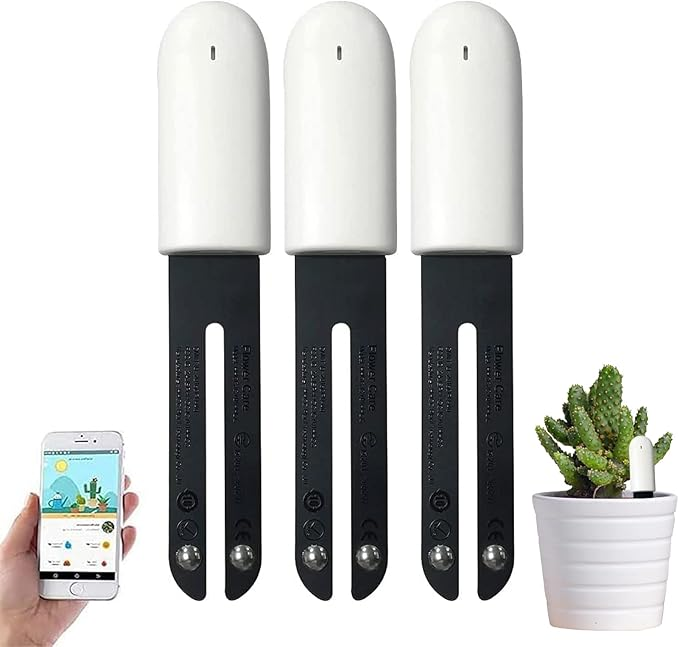
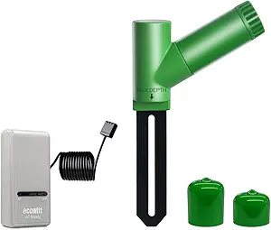
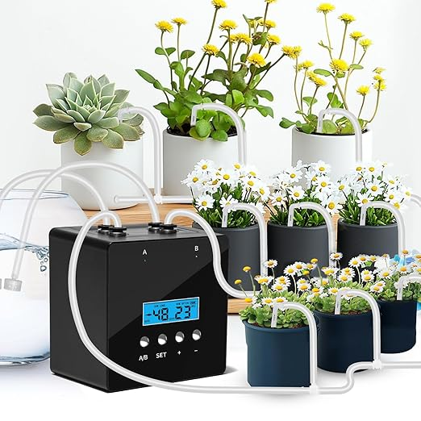
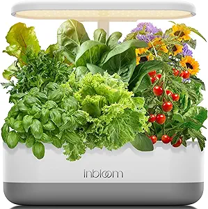
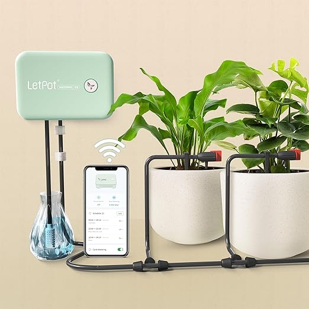

## Voice of the Customer Benchmarking
To learn what kind of home improvement device we should make, we brainstormed several ideas and decided on making a smart plant sensor that can help the user take care of plants using sensors and alerts. In order to get a better understanding of this product, and more specifically, the needs of our users when using a product like this, we benchmarked five similar products with the goal of generating 100 user needs, which we proceeded to categorize and rank on importance.
### Selected Products for Benchmarking
#### 1. [Sinbeda 4 in 1 Plant Water Monitor](https://www.amazon.com/Automatically-Temperature-Fertility-Bluetooth-Hygrometer/dp/B0B6QVF3M4/ref=sr_1_9?crid=2VE0OK43XV2H5&dib=eyJ2IjoiMSJ9.fMroIyQzQiCykwfuFYgWXue0WNwL_cxZ_l5reGArKTQpcQW_WX8IDYRZpEEXZiQ8pDniZTd5DTasy9MkSUA0KgAbLCilJRHw3IyDD9r6cvJ3GAilf3Fuou6R0-jxUxDjU7HkB3Ji1yOPPYDYYLtCDMOsb3hcl4n0lemLS4F6EfIm8dIAQOdylc7j1HqAukcuUP8adbw6imX_NF6h7xodWc3ftVgZ8vf-ATdek4Ljrefg8pDg869VGWP8kvq3tgLIqhNm1efyljfhLGAF-39piFIUShumwVKlXM7fDOY8CuA.4QDVd5TpyG7IhfERH2moGHcvI-MLoTJNEc9tqLg7zbg&dib_tag=se&keywords=smart%2Bplant%2Bmonitoring%2Bsystem&qid=1757787409&sprefix=smart%2Bplant%2Bmonito%2Caps%2C232&sr=8-9&th=1)

- **Price:** $72.99
- **Vendor:** Amazon
- **Description:** The best choice for planting: Monitors humidity, light, fertility, temperature level. Find your plant in the extensive database of more than 6,000 plants and save the daily growth record in the iOS or Android app "Flower Care" or "Mi Home" via Bluetooth connection, which will help you grow your plants and flowers better.

##### Positive Comments
| Voice of the Customer | Restated Customer Need |
| --------------------- | ---------------------- |
| “If you have Home Assistant and BLE working, this product is awesome. The iPhone app is not bad but it would be nice to allow for historical graphs. The graphing capability for home assistant includes luminance, microsiemens per centimeter, moisture, and temperature.” | 1. App can store data and generate historical graphs (Explicit) 2. Device will track important data related to the plant (Latent) |
| “This is very easy to use. Have app installed and insert the device in soil. Perfect to record soil temperature. However it won't give any other information in case of any issues with the plant. Worth the price. Am keep changing every week for all my problematic plants. Wish to buy another one.” | 1. App will alert any detectable issues with the plant (Explicit) 2. Device can be moved and reprogrammed easily (Latent) 3. Price should be worth value of device (Explicit) |
| “I bought three of these about a year ago, and forgot to change the batteries in them. They seem to get about 3 months of battery life, if you aren't syncing then constantly? They work great, though. Only issue with device is that I wish the Bluetooth range was longer. The app, though, could use some work… You can't create your own plant, though, you have to select from the options and accept the light and water requirements it gives. And it goes by scientific name, but it does let you rename them now… I just set up my newest one… still super quick and easy to pair. It's difficult opening the back, but I'm okay with that considering I leave some of them outside in the PNW rains. It also doesn't alert you when things are dry, you have to check on it manually... ” | 1. Device can have long range connections (Explicit) 2. Device will give several types of alerts that could be relevant (Latent) 3. User can add custom plants with custom requirements to sensor (Explicit) 4. User can rename plants in app (Explicit) 5. Device electronics are protected from weather and outdoor elements (Latent) |
| “The instructions are kind of garbage and direct you to scan a QR code to download the app… my phone threw up an immediate red flag. I recommend only installing apps that are in the app store… it works with both the "Mi Home" app and "Flowercare". Mi Flora is difficult. I was never able to find the sensor to add, so I gave up...another worthless account created out there in the ether. Flowercare was much easier to use, and I was able to add the sensor pretty easily… About 5 mins later it stopped sending data. Again, ready to send it back. However, I also had the phone app open (which is nice BTW). It can only send to one device at a time. When I closed the phone app, it started sending to HA again. All in all, I'm pleased with it.” | 1. Only 1 app for the device that is high quality and user-friendly (Explicit) 2. Device connections are stable and stay connected (Latent) 3. Instructions for device and app should be well made (Explicit) 4. App can connect to several devices at the same time (Latent) |

##### Negative Comments
| Voice of the Customer | Restated Customer Need |
| --------------------- | ---------------------- |
| “I so wanted to give this a high rating, however the app won't download for the latest version of Android, so it's basically useless.” | 1. App stay up to date so it keeps working (Explicit) 2. App can be backwards compatible with older phones (Latent) |
| “Do not buy!!! Look at the app it asks you to download “flower care” and it has abysmal reviews all mentioning the connection issues and broke functionality. Several report the sensors just stop working as well.” | 1. Sensors keep working for a long time (Explicit) |
| “Mine died quickly. I've removed the app. Would not recommend… I'm using them outdoors, dry summer, in 1 foot deep standing boxes. I found them hard to set up and hard to connect requiring many attempts to reconnect before success whether inside or our next to the device, even when holding the device in hand. Moisture levels regularly show low % moisture when soil is moist to touch or much higher when tested with other meters (I have several direct reading meters that give results comparable to each other, but different from this meter). I bought three meters of this brand. They give different results when placed side- by- side. Soil fertility remains low even after applying water souluable fertilizer. I don't trust these. The app is of limited value. You must associate each meter with a specific target plant. The app does not include the plant varieties I plant and I can't seem to add any plants to the database. It is difficult to exit the app without signing out. The permissions required to use the app are excessive for a poor quality app. I do appreciate that the app shows a history of records, though I'm not currently confident in the ?daily average? results. I would prefer a more open app, friendlier permissions with easy opt out provisions, a longer probe to at least 8" depth, more consistent results, better connection success. I do not recommend this version… I'll be looking for improved versions.” | 1. App allows the user to opt-out of permissions and is designed with user privacy in mind (Explicit) 2. Sensor can reach into deep soil for better readings (Explicit) 3. Sensors give accurate and consistent information (Explicit) |

#### 2. [ECOWITT GW1206 Soil Moisture Tester Kit](https://www.amazon.com/ECOWITT-GW1206-Moisture-Tester-Gateway/dp/B0DD42VGPD/ref=sr_1_5?crid=FMIFM96BNE0T&dib=eyJ2IjoiMSJ9.Yg7b0PpwagFXZCXNs33EVNiG22Si2AcaRO9T5hZJxQbc9jxIFbJfD5-WRJmCXvBPXED3T7d8TdzbQXjsKHChP7iEfm8QZ9D1EsGhKrjSGH6X17c6D70oJAc_ay_SPp8fAgIKoiNibcNNS1Ef9eRr2l4Hd6OQAWi_KYyBRSJn3vo5-ycup-iXCayh4q4RkYf5mzWLb0sOD_BrZw8zrxACECTAKICTf5HkyYEa1QKlINQrFfdyLn-P0KN1hnZB9jQozCBNdvfnp_OpqWz5YM_VvmNBb1BP09PIsQ-L5veBPag.y6VnW35_nWzDJcxMsgo45bgOiuw3UfuY5d47W6vGWps&dib_tag=se&keywords=ecowitt%2Bsmart%2Bwater%2Btimer%2B%2B%2BSENSOR%2BKIT&qid=1757894636&sprefix=ecowitt%2Bsmart%2Bwater%2Btimer%2B%2B%2Bsensor%2Bkit%2Caps%2C147&sr=8-5&th=1)

- **Price:** $55.99
- **Vendor:** Amazon
- **Description:** Soil moisture sensor kit and Wifi gateway for remote data access

##### Positive Comments
| Voice of the Customer | Restated Customer Need |
| --------------------- | ---------------------- |
| “I own a bunch of these. They’re accurate, easy to set up, and basically maintenance-free. Two of mine gave up, but before I could even get annoyed, the seller had replacements on the way. That’s customer service done right. Living in Florida means these sensors sit through daily rain and brutal heat, and they still perform like champs. Well-built, modern, and integrates smoothly into my setup.” | 1. Product needs to be accurate and reliable (Explicit) 2. Product needs to be durable (Latent) |
| “We have a midsized back yard garden. I started to use a drip irrigation system last year because hand watering was starting to take a long of time, dragging the hose from bed to bed. These little devices connect to an EcoWitt receiver. I'm using their GW1100 model. Once you have that receiver set up... and it's pretty easy... these moisture sensors find the receiver automatically as soon as you put in the battery. You push them in the ground near the base of the plant you want to monitor and it reports the moisture percentage of the soil back to the receiver about every minute. if you connect your receiver to the EcoWitt weather server, it will log all your data and you can see both the current readings and graph the history of each sensor. So far we have just 4 sensors throughout the garden to sort of give us an overview of each crop. How much is enough is still a question that is yet to be answered. An online search of the proper soil moisture percentage results in a variety of answers, but then don't most online searches. I'm still digging for some more useful answers to that question, because so far the internet says between 20% to 80%. That's quite a range! We trying to stay at around 50% and water when it drops to around 25% and are also keeping an eye on the various plants. I should also confess I like gadgets, so I suppose you could just keep an eye on your plants.” | 1. Product needs to be easy to set up and use (Latent) 2. Product should have data about target readings (Latent) 3. Product needs to save consumer time, and reduce effort (Latent) 4. Product needs to log data not just present current measurements (Latent) |
| “I have five of these operating around my home. I live in an area with extremely poor soil conditions that subject my slab-on-grade home to extreme foundation movement if I don’t keep soil moisture consistent season to season. During long, hot summers my soil dries out and causes my foundation to shift dramatically. I bought a couple of these sensors in late summer 2019 to gauge long-term trends to determine ideal soil moisture conditions. After a year of gathering data, I found a good range for soil moisture to minimize foundation movement. I purchased three more (and a WN51) to stake along the perimeter of my home to monitor my soil moisture in real time. By getting this data I’m able to determine when I need to run the soaker hose and irrigation system around my home. While my foundation still moves, I’ve noticed a dramatic difference associated with keeping soil moisture levels within 5-7% of their target. I realize this might not be the targeted use of these devices, but I believe their reliability in my application serves a ringing endorsement for others looking to monitor the moisture levels in their planters in real time. The user interface is average. The app, without a full PWS, seems less than functional. I almost prefer the web-version to the app because it only shows me the active data. This, ultimately isn’t too important to me. If I could export daily data as a .csv, I’d like that ability but it’s not a deal breaker as my primary use is observation of long-term trends. For those with privacy concerns, it’s easily addressed by connected the hub to the internet via a secured guest network. If you’re not already running all of your smart devices on their own secured network away from personal devices, I suggest you do so. I’ve got a couple notes for prospective buyers: 1) I think I prefer this model (WH51) over a similar moisture meter (WN51) made by Ecowitt. These seem more granular in their ability to notice subtle differences in moisture and react much faster to changes in moisture levels. 2) Use a good lithium ion battery. At least two of my sensors have functioned for almost a year without needing to change a battery. They’ve operated in temps from 20-110F. 3) Spend 5 minutes calibrating your devices to the type of soil where the meter will be placed. Mine are primarily in Texas black clay and they require some calibrating tweaking from default. Also, in relation to the first point, the WH51 seems to have a much larger range from 0-100% saturation than the WN51. No clue why, but I like the more precise ability to measure incremental changes in moisture. I’ll update my review over time with any additional notes or issues that may arise.” | 1. Product needs to be able to keep an extensive log of data to effectively see data patterns (Latent) 2. Product needs long battery life (Explicit) 3. Product should include a calibration procedure (Latent) 4. Product needs to handle a large range of temperatures (Latent) 5. Product should be able to auto water the soil (Latent) |
| “I have about ten fruit trees and 10 blackberry plants, I had them for 3 years and they have come to the large you really need tp manage the water levels to get the most and best fruit. I jumped in head down this year with all the correct fertilizers and oils the plants need but, when it came to the water or moist of the soil it looks dry on the first inch or so but then where the roots are it's wet and you over water. I looked for months on the best products to just have the water level happen automatically each day as needed. I already collect 3300 gallons of rain water from my house so the water has all the natural chemicals needed, I have a pressure pump system to supply my mini sprayers but now how wet is the soil.??? I read up all the descriptions of how to setup and use this system and found next to nothing others then call them if you buy the units and need help. I did not want to waster my time with someone that may not work but, I took a chance and I I glad I did. THEY COULDN'T be easier to pair and install. You simply hook the receiver to your wifi in settings then downland their app next, put a battery in the soil unit wait 30 second and the sending units are seen by the app automatically I WISH other system were this easy you can't make a mistake. Buy these product the are outstanding in every way, attached are some screen shots you can check the soil from location you happen to be at and for me it just press that zone button and my plants are done, I only have to manually press the water button for that zone if the soil is behind dry even after the automatic cycles. GREAT product and , oh by the I own a world wide computer computer and know a GREAT product on the technology side and this rates the highest on ease of setup and results.” | 1. Product needs to be easy to set up and use. No technical skills should be required (Explicit) |

##### Negative Comments
| Voice of the Customer | Restated Customer Need |
| --------------------- | ---------------------- |
| “This moisture meter is great, from the accuracy to how user-friendly the app is, it would get 5 stars, however there's one MAJOR problem...on the top of the meter there is a red light that constantly flashes (indicates WiFi connection), & this can hugely effect your Plants' sleep cycles, potentially causing herms. Once again the meter itself is phenomenal, but that flashing light makes it virtually unusable, so until EcoWitt releases a cover for the light or a version without the light, I can't give this more than 3 stars.” | 1. Product cannot inhibit or damage plants in any way (Latent) 2. Product should not emit light (Explicit)|
| “I purchased 4 of these sensors. They seem pretty easy to set up. They're bigger than you would think. They worked great for 3 weeks. And now they have stopped registering this proper moisture level. the durability is not great on them apparently. They are not reading accurately at all. I ordered a fifth sensor and put it in a pot with the other one and set everything up on custom, and they're not reading the same at all. It only seems like the shelf life for these is 3 weeks. They worked great in the beginning and helped the plants be a lot healthier but seems like an absolute waste of time now. As you can see in the picture probe 4 and 5 are in the same exact pot and reading completely different Probe number 4 is about a month old and pro 5 is brand new. They are not tracking the same. customer service is a joke and are completely useless. also u have to set the sensors to custom for them to work at all. it's very easy to do and find your set points. but even with that they seem to not last” | 1. Product needs to track data consistently (Latent) 2. Product needs a multi year service life (Latent) |
| “The item worked okay, but it has failed, and though I have a two-year warranty, they email back and forth, but haven't honored the warranty, and so I am giving up. Buy knowing that if it fails, the warranty will not be honored. The item failed in the first year. I tried to leave a one-star review, but it wouldn't click...” | 1. Product should be user repairable (Latent) |
| “They do work great but I've found them to be very fragile. Have had 3 of them break. The part that goes into the ground is very thin and rigid. They all have broken where the thin black sensor meets the green plastic.” | 1. Product needs to be robust and durable (Latent) |

#### 3. [RUNWUSHENG Automatic Plant Waterer Indoor](https://www.amazon.com/RUNWUSHENG-Watering-Houseplants-Irrigation-Programmable/dp/B0DT6F4W95/ref=cm_cr_arp_d_product_top?ie=UTF8)

- **Price:** $54.99
- **Vendor:** Amazon
- **Description:** Auto Drip Irrigation Kit with 20 outlets and a programmable Water Timer

##### Positive Comments
| Voice of the Customer | Restated Customer Need |
| --------------------- | ---------------------- |
| "This is a pretty neat system. Working great so far. Installation was easy as well. Today is only day 2 of use, so I know that I will have to adjust my timing as I learn how much time it needs to run and how often so I do not over water my plants. I bought 2 automatic watering systems. I setup 13 plants on one (6 on one line(A)/7 on the other line(B)) and 12 on the other, dividing that to 6/6 plants. So far so good and would definitely recommend." | 1. Product should be easy to set up (Explicit) 2. Product should have multiple connections (Latent) |
| "We left for a month long vacation and I had just started some tree seedlings and didn’t want them to die while we were gone. I put the spike in each pot, linked the tubing to each pot and used 2 buckets of water to put the end in for a water source. I programmed it to water every 3 days. When we returned the seedling were perfectly watered and looked great. After trying so many cheap, quirky ways to keep plants moist while away, I was so happy to find this system. It’s worth every cent. It was easy to set up but I did have 30 pots so it took some time. I tested it several times and there was no leakage." | 1. Product should be expensive and be considered worth its value. (Latent) 2. Product should be automated (Explicit) 3. Product should have no leakage (Explicit) 4. Product should be waterproof (Explicit) |
| "I have a lot of plants. It brings the beauty of outdoors inside and purifies the air. But what do you do when you go on vacation or if you are so busy you forget to take care of your plants. This automatic watering system could be your answer. It comes with plenty of tubing, "T" connectors and watering tubes for up to 20 plants. The setup is explained well in the instructions that come with the kit and videos in the listing so I won't go into detail here. Just be sure you measure out the right lengths of hose before you cut and have a bucket of water that can hold the total amount of water you will need for the duration of the time you will be unable to water the plants yourself. To use this for multiple plants you have to do a little math. The longest you can run each of the pumps each time is 15 minutes. The total amount of water each pump can deliver in that time is 1.5 gallons (24 cups). Per minute, the pump delivers 1.6 cups. If you need more water than that, you can set the pump to run multiple times. You must divide the amount of water by the number of plants you are watering. For example, if you have 4 plants on one pump, the water delivered will be divided by 4. So if the pump is run for the full duration, each plant will get the same amount of water (6 cups). If your plants need less water, you set the run time accordingly. if you cannot divide your plants into 2 groups (1 for each pump) that need the same amount of water you will either need more of these systems or have to look at other options. Bottom line, this is a great watering solution to ensure that your plants survive a vacation or absent mindedness. Calculate your watering needs before purchase to see if this is a good solution for you." | 1. Product should have a good user manual (Latent) 2. Product should have a good battery life and a long run time (Explicit) |
| "I've been looking for a watering system like the RUNWUSHENG Plant Watering Device for awhile and was pleasantly surprised at the space economy this offers. Everything you need to get up and running is provided, including well laid out instructions with pictures. Really the only thing you need to add yourself is a water bucket of which my first use for testing purposes was a 1 gallon plastic milk jug. I will at some point be setting this up in a permanent location utilizing a larger 3 gallon, clear water jug. The timer function of the RUNWUSHENG Plant Watering Device is very easy to set up and in my opinion, takes a little experimentation to get just right for various environments where this device will be used. Since each plant has its own unique watering needs for overall plant health and growth, I think a person can easily expand on the device water tubes a little by adding drip emitters for any given particular plant that need less or more water than others in the system. I also like that the RUNWUSHENG Plant Watering Device utilizes both USB and AA battery power which is great feature just in case the power goes out for an extended period of time. Each of the parts included with this device seem to be very quality pieces as well as the timer/pump housing and the water tube connections pieces as well. The functionality of this product just through my initial testing has been outstanding. Overall, if you always want to keep your plants watered and healthy, the RUNWUSHENG Plant Watering Device is a real good start at a very reasonable price point. Once I have designed a reasonable location, I will be permanently setting it up for the indoor growth of herbs and flowers. I would highly recommend this product." | 1. Product should have the ability to switch between AC current and a backup battery (Explicit) 2. Product should be easily programmable according to user needs (Explicit) 3. Product should have a good quality build (Latent) |
| "Great product, only downside is that it takes a good while to get set up but after that you're saving time from then on by not needing to water your plants. The pump unit is a little bulkier than other products that do the same thing, and I wish there was a little more tubing provided so I could run it more neatly." | 1. Product should be a quick setup (Explicit) 2. Product should be as lightweight as possible (Explicit) 3. Product should have long-range accessibility (Explicit) 4. Product should have backup connectors (Explicit) 5. Product should have replaceable connectors (Explicit) |

##### Negative Comments
| Voice of the Customer | Restated Customer Need |
| --------------------- | ---------------------- |
| "I find this a bit fussy and takes a while to get all set up and the rate of flow as needed. This waters my plants with ease. It isn’t the nicest look in the house with all the hoses, so I am using it in my greenhouse setup. The quality is good and so far has been reliable. This is a decent value." | 1. Product should look aesthetic (Explicit) 2. Product should be outdoor accessible (Explicit) |
| "Worked for a week or so. Now I can't change settings and it doesn't pump on the current setting. Don't waste your money" | 1. Product should be reliable and not break down so soon. (Latent) |
| "Not the easiest to put together and distribute water and is a lot smaller than i thought" | 1. Product should be as compact
 in size as possible. (Explicit) |

#### 4. [inBloom 12 pods Hydroponics Growing System](https://www.amazon.com/inbloom-Hydroponics-Germination-Accelerate-Adjustable/dp/B0CFQNTGX6/ref=cm_cr_arp_d_product_top?ie=UTF8&th=1)

- **Price:** $79.99
- **Vendor:** Amazon
- **Description:** The inBloom 12 Pods Hydroponics Growing System is an indoor garden kit that features a LED grow light, adjustable height, and a 4.2L water pump for accelerated plant growth, suitable for cultivating various herbs, veggies, and flowers.

##### Positive Comments
| Voice of the Customer | Restated Customer Need |
| --------------------- | ---------------------- |
| "I've tried a few different hydroponic growing systems, and this is one of the best I've used. It's a bit cheaper than some other systems out there, but it works well. The plants grow fast and healthy. There are several features that make this one stand out: 1) Larger footprint than other 12-pod gardens. While this means that it takes up more space, it also means that the pods are spaced further apart. When you’ve got your garden really growing, having some more space between plants is a big deal. I’d rather lose a few more square inches of table space if it means that the plants have more room. It seems only this garden is designed like this. 2) LED array is really good in this model. The lights are brighter than some of my other gardens, and I’ve seen distinct differences in growth and leaf color based on how bright the lights are. This one is a beast. Also, unlike every other one of my hydroponic gardens, this one has each LED recessed inside individual cells instead of being flush with the bottom of the light fixture. This will help with two things: leaves that grow to the top will not be in contact with the LED and get burned as easily, and the recessed cells direct more of the light down instead of having a lot of it spill out outside of the garden. Your plants will get more of the good stuff! 3) Drain hole on bottom. Only one of my other gardens have this, and it’s very nice. Every couple of months, I like to drain the tanks and refill them with fresh water. Over time, nutrients and gunk may build up in the tank, so a full drain and refill will restore water purity. Having a drain on the bottom makes it a lot easier than lifting the entire grow platform out and dealing with the mess of roots. 4) This hydroponics growing system has a low water level alarm. I’ve forgotten to add water to my tank before when water levels are low, and it’ll effect plant growth. With the alarm, a beep will tell you when you need to water. Very convenient and intuitive! 5) Useful memory function for emergencies. Once my family told me that the power was cut off at home, I was at work and was very worried that the plants would die. When I got home, the machine was still working. The plants were perfectly fine, thanks to the hydroponics system memory. I'm so glad I have it! It really takes the worry out of plant care." | 1. Product should not be too expensive (Explicit) 2. Product should have strong LED lights (Explicit) 3. Product’s LEDs should be spaced properly so the leaves close by don't burn (Explicit) 4. Product should have drain holes at the bottom for easy removal and refilling of water (Explicit) 5. Product should have a low water level alarm or sensor. (Explicit) 6. Product should have a memory function for emergencies like power cuts (Explicit) |
| "Highly recommend. Love to have fresh lettuce around and don’t have a green thumb at all but it’s super easy with this." | 1. Product should be indoor farming accessible (Explicit) |
| "This is an excellent option. A solid brand that offers more reliability and a warranty unlike ultra cheap generic brands but not NEAR as expensive as the big name brands while still giving you the same quality product. I actually bought two seperate inbloom systems. This large one and a smaller one. Comparing the two side by side this one definitely has a major perk but a few downsides as well. I'm honestly surprised. I would expect the systems to maintain the same quality. The downsides of this are really only compared to the other system of the same brand! The perks - The biggest perk is that if you manually turn the light off it will still keep track of the time and turn on 8 hours later. Living in a rural area the power sometimes flickers. Meaning the system totally resets and the grow lights may be on all night long. With this one I can just tap the light button before bed and 8 hours later it will turn on. With the smaller one if you tap the button it totally turns off the lighting, meaning I must manually turn it on the following day. The water gauge is enclosed in sturdy glass, no need to worry about bumping it. The drawbacks - The pieces between the two systems aren't really interchangeable. The smaller system includes stakes for plants and this one does not. However, the smaller systems stakes are too thick to use in this. I solved this by using chopsticks. The grow baskets are also different sizes. If I get them mixed up the basket for the smaller system will sit about 1cm raised out of the slot of this system. The smaller system is also a little better engineered overall. No knob to raise or lower the lamp. No extra wiring running from the base to the lamp. Small things that make it feel nicer. All in all it's still a great product. A few caveats but nothing I wouldn't notice if I wasn't comparing two products from the same brand. I'd definitely recommend it." | 1. Product should be programmed to turn on after every 8-hour turn-off time period (Explicit) 2. Product should be leak-proof (Explicit) |
| "Very fun item to have around the house . The design is also beautiful , and fits right in" | 1. Product should be aesthetic (Explicit) |
| "Small enough to fit in any place I love this little garden. I bought it to plant herbs and within a week some of herbs started sprouting. I recommend it for everyone who enjoys watching plants grow." | 1. Product should be as small in size as possible (Explicit) 2. Product should have a good plant growth speed (Explicit) |
| "Set this up in about 15 minutes! The pump makes a low humming noise but nothing loud at all. This holds a ton of water as well! I was a bit dissapointed as I only had 11 lids and had to use an alternative option for one of the pods. For some reason the gauge also won’t show the water level as it is supposed to but that may have been installation error. Can’t wait to see what grows!" | 1. Product should be easy to set up (Explicit) 2. Product should either be completely silent or have a low sound (Explicit) 3. Product should have a good water storage (explicit) |

##### Negative Comments
| Voice of the Customer | Restated Customer Need |
| --------------------- | ---------------------- |
| "At first, I thought this was a great system. I had it running side by side with an Aerogarden and it was working comparatively well. The lights were great, things were growing like crazy, etc. Then it went and showed me why it is better to spend a little more on a better product. The pump stopped working after about 5.5 - 6 months. I planned on keeping it just for the lights but had to throw the whole thing away because it was just disgusting. It is really sad that it only lasted maybe 6 months at most. I received it in January and the pump stopped at the end of June. It really is a shame because I liked the look and features. I will probably only buy Aerogardens from now on." | 1. Product should be reliable (Latent) |
| "Followed all the instructions, set it up, and won’t stop beeping. The pump isn’t working either. Customer service not available to help set up, registration portal not accepting Amazon order id to register product. For all those reasons, Im out. Returned this the same day I received it. You get what you pay for." | 1. Product should come with a clear and explicit  instruction manual (Explicit) 2. Product should include user repair instructions in case of emergencies (Explicit) |
| "Bought this for my mom for Christmas. She LOVES it. However, after only 4 months of use, the light has stopped working. Very disappointing." | 1. Product should have good quality components (Latent) |
| "Worked decent until it broke when it was too late to return it. All of my herbs are dying without the light and water pump functioning." | 1. Product should have a good quality built so it doesn't break easily (Latent) |

#### 5. [LetPot Automatic Watering System for Potted Plants](https://www.amazon.com/Automatic-Watering-Control-Irrigation-Shortage/dp/B0D982BBSB/ref=sr_1_10?dib=eyJ2IjoiMSJ9.97-1v2-xyuaXvaxLaPI4NBBCVfzGfiiDfHsCg7QVvE7LEewfPETcHWcMe2vWGdofewYAW-Xeu3rGASXJrDm587ewhWzEnvgFst4YBYNZ8BYxzktLoSHyBnLgYBeQFHT0JmoBQmax0jnuQJfSa9D1ib3ZdjilLo8PMBANb0o049l0_7FIx03ob-xKtyzJ31nN166Zg6vQ4Pe2h6epeI-7ppR_At7Y_bSIQVH3P1vdw22gQqfu2NDWr5ca9-U45kn7gwZsyXoC_v57D3mG9v6deu9mvrn6sXaWyiRJJiIaQMA.Xwa0KXkbJp6rYEQL1pZhSyembXx6q0gk3yRSMxJjUwY&dib_tag=se&keywords=auto%2Bwater%2Band%2Bfertilizer%2Bindoor%2Bplant%2Bsystem&qid=1757994696&sr=8-10&th=1)

- **Price:** $69.99
- **Vendor:** Amazon
- **Description:** The LetPot automatic watering system now includes an anti-backflow valve to prevent the siphon effect, enhancing watering efficiency. Its upgraded 2.0 chip ensures faster and more stable connectivity, while the LetPot app supports up to 5 simultaneous watering tasks for maximum flexibility. Combined with an advanced spiral lock, it maintains better water pressure retention, ensuring consistent and reliable irrigation every time.

##### Positive Comments
| Voice of the Customer | Restated Customer Need |
| --------------------- | ---------------------- |
| "This product works great and it kept my plants healthy all winter when I brought them inside my house. I purchased it because we were going to be gone for a month with plants left indoor and I decided to give this product a try. The feeding line would need to be cut for each plant/pot and the only downside in this case is that I will have to have the same setup every time I bring my pots inside but I took pictures and video so I can replicate it next year. Product setup was very easy and it worked great. The app can be designed better for setting up watering frequency but I figured it out. You will need to setup an account if you want to access it while you are away from home else it can also be used with just Bluetooth and you don't need to have an account setup if you want to use it that way. This tells me that company is not interested in collecting your data. It worked so well that after returning back from our trip, I decided to leave it for the rest of the winter and used this system for irrigation. It actually worked better because watering frequency is consistent and you can figure out what works for the plants. In addition, you can setup water flow for each plant by adjusting how much water flow it will need based on the size of the pot and plant. I will be using this every winter for watering my plants. I would highly recommend this product." | 1. Reliable plant watering system, easy setup, works for indoor plants during extended absences (Explicit) 2. Easy to set up, maintains plant health, works via app or Bluetooth (Explicit) 3. Peace of mind while away, predictable plant care, non-intrusive (Latent) |
| "I was looking for something to help water plants while away on long trips and gave this a try based on other reviews. After a lot of trial and error, I am super happy with this product and will share some tips that hopefully help: 1. The product doesn't specify drip rate so this was a little tough to figure out. I use it for my herbs and veggies and found it works well with the drippers wide open and running for 30 min every other day for my veggie plants. For my herbs, I run it for 15 min every other day. For this reason, I like the cycle water feature over the schedule feature. Cycle water allows you to run it every other day, whereas schedule requires you to pick which days of the week you want to run it. This time frame works well for my thirsty tomatoes, peppers and herbs. 2. You can split the hose in multiple directions! I have one pump that branches off in two separate directions and it doesn't affect water flow. This was a lifesaver as I didn't want to buy a third system just for a few herbs. See photos for more details. 3. The unit is waterproof but the plug itself is not. I keep both pumps in a small husky box to keep everything dry. I got a couple railing planter hooks to hold the box off the side of my planter. I keep water in a large plastic tote that fits perfectly under the planter. 4. The anti backflow valve prevented the pump from working. I ditched it and it's been running smoothly ever since. I haven't noticed any issues with leaking, either. Make sure you connect the hose all the way to prevent leaks. 5. Aim the drippers at the base of your plants. I was hoping they would magically water the entire planter, but they only cover a small area. This is part of why I run it for so long. Hang on to your extra hose and drippers! This will be helpful if you add or move plants." | 1. Customizable watering for different plants, ability to split hoses, waterproof system, avoids overwatering (Explicit) 2. Adjustable drip rate, multiple plant watering, waterproof pump, proper setup prevents leaks (Explicit) 3. Efficiency in watering diverse plants, low maintenance, minimal worry about leaks (Latent) |
| "I am using the Letpot watering device in a deep water culture (DWC) grow room. It took about a week to get the watering levels exactly where I wanted them because while you can water multiple plants at one time, there is only one siphon from your water source. So, you have to adjust the flow for each plant accordingly. Very easily done, it just takes a little tweaking. If I was using soil instead of DWC, the proper amount to water is even easier to determine. Great little product that makes my gardening life MUCH easier." | 1. Precise watering control, works for multiple plants at once, adjustable flow per plant (Explicit) 2. Flexibility to water different plant setups (Explicit) 3. Optimization for plant growth, minimal manual oversight once set (Latent) |
| "I was surprised how high quality this is for the price. The tubbing and emitters are really nice. The pump is plenty strong, right now it is watering 12 pots in our green wall with no problem. Packaging was beautiful. App works great. All in all really happy with my purchase!" | 1. High-quality system, strong pump, supports multiple plants (Explicit) 2. Durable tubing and emitters, strong pump, works for multiple pots (Explicit) 3. Confidence in reliability, scalable for larger plant setups (Latent) |
| "Bought and set up this plant watering system ahead of my 17 day vacation to keep my plants watered and alive while I was away. Setting up the watering station was straight forward and simple. I also setup WiFi connectivity so that I could control watering remotely. While I was away, I set it to Cycle watering. This kept my plants well hydrated and I am happy to say, my plants all looked healthy when I returned. One issue I had was using the Scheduled Watering feature. It seems more complicated than it needs to be, so I used the Cycle Watering feature instead. Another issue is that the hose connection to the device will leak if you do not properly adjust the water flow of each dripper. This is all explained in the manual. Other than that, it works fine for my needs. I like it so much, I will be purchasing another for my outdoor plants." | 1. Reliable automatic watering for vacations, simple setup, remote control via WiFi (Explicit) 2. Easy scheduling, works remotely, adjustable flow per plant (Explicit) 3. Peace of mind, stress-free plant care while away, consistent hydration (Latent) |
| "Awesome product bought it to use while I would be out of town but works great for everyday use also. I put it inside an electrical whether proof box as the plug itself is not waterproof absolutely love this product connected seamlessly to WiFi and Bluetooth easy to set schedules and app is user friendly highly recommended! When I returned from vacation I was very pleased to see how much my plants have grown!" | 1. Flexible for vacation or daily use, seamless connectivity, user-friendly app (Explicit) 2. Connectivity via WiFi/Bluetooth, easy scheduling (Explicit) 3. Convenience, confidence in automation, minimal setup frustration (Latent) |

##### Negative Comments
| Voice of the Customer | Restated Customer Need |
| --------------------- | ---------------------- |
| "I bought this for my plants while on vacation and it did not work as expected. The water flow to the drippers was inconsistent and some of my plants did not get watered at all. Setup was more complicated than I anticipated, and I spent way too much time adjusting everything. The app was confusing and didn’t make it easier. Overall, I am disappointed and will not be purchasing again." | 1. Consistent watering for all plants, easy setup, intuitive app (Explicit) 2. Predictable watering, simple setup, user-friendly app (Explicit) 3. Trust in automation, peace of mind during trips, reduced frustration (Latent) |
| "The system arrived quickly but when I tried to use it, the pump didn’t work. I followed the instructions but it kept shutting off. I had to contact customer service multiple times and it took a while to get a replacement part. Once fixed, it worked okay, but I expected better reliability for the price." | 1. Reliable pump, functional out of the box, responsive customer support (Explicit) 2. Working pump, replacement support (Explicit) 3. Confidence in product quality, minimal downtime, reassurance (Latent) |
| "I tried to set up the scheduled watering but the app kept crashing. I could not connect it to WiFi and had to rely on Bluetooth. It’s hard to adjust the flow for multiple plants and the instructions are not very clear. Works better for one or two plants, not for a whole garden." | 1. Stable app, easy WiFi connection, adjustable watering for multiple plants (Explicit) 2. Functional app, multiple plant support (Explicit) 3. Convenience, reduced stress, efficient watering for many plants (Latent) |
| "I didn’t realize the plug is not waterproof. After a rainy day, the system stopped working and I had to dry it out completely before it would work again. This is not ideal for outdoor use." | 1. Weatherproof system, reliable operation outdoors (Explicit) 2. Waterproof plug, safe in rain (Explicit) 3. Worry-free outdoor use, durability, minimal maintenance (Latent) |

## Organized Need Statements

### Initial Generation

### Categorization
To sort through all of our user needs, we then categorized all of them into four categories, ranging from critical features that are required to meet our customers' satisfaction, to features that would be nice to include but don't make an overall difference in our design.

#### Critical (Must-Have)
1. App can store data and generate historical graphs
1. App will alert any detectable issues with plant
1. Price should be worth value of device
1. Device can have long range connections
1. User can add custom plants with custom requirements to sensor
1. User can rename plants in app
1. Only 1 app for the device that is high quality and user-friendly
1. Instructions for device and app should be well made
1. App stay up to date so it keeps working
1. Sensors keep working for a long time
1. App allows the user to opt-out of permissions and is designed with user privacy in mind
1. Sensor can reach into deep soil for better readings
1. Sensors give accurate and consistent information
1. Product needs to be accurate and reliable
1. Product needs long battery life
1. Product needs to be easy to set up and use. No technical skills should be required
1. Product should be easy to setup
1. Product should be automated
1. Product should have no leakage
1. Product should be waterproof
1. Product should have the ability to switch between AC current and a backup battery
1. Product should be easily programmable according to user needs
1. Product should be a quick setup
1. Product should be as small in size as possible
1. Product should have strong LED lights
1. Product’s LEDs should be spaced properly so the leaves close by don't burn
1. Product should have drain holes at the bottom for easy removal and refilling of water
1. Product should have a low water level alarm or sensor
1. Product should have a memory function for emergencies like power cuts
1. Product should be indoor farming accessible
1. Product should programmed to turn on after every 8hr turn off time period
1. Product should leak proof
1. Product should come with a clear and explicit instruction manual
1. Product should have user repair instructions in case of emergencies
1. Product should be reliable
1. Product should have good quality components
1. Product should have good quality built so it doesn't break easily
1. Reliable plant watering system, easy setup, works for indoor plants during extended absences
1. Consistent watering for all plants, easy setup, intuitive app
1. Reliable pump, functional out of the box, responsive customer support
1. Stable app, easy WiFi connection, adjustable watering for multiple plants
1. Weatherproof system, reliable operation outdoors

#### High (Very Important)
1. Device will track important data related to plant
1. Device can be moved and reprogrammed easily
1. Device will give several types of alerts that could be relevant
1. Device electronics are protected from weather and outdoor elements
1. Device connections are stable and stay connected
1. App can connect to several devices at the same time
1. Product needs to be durable
1. Product needs to save consumer time, and reduce effort
1. Product needs to log data not just present current measurements
1. Product should include a calibration procedure
1. Product needs to handle a large range of temperatures
1. Product should be able to auto water the soil
1. Product should have a good user manual
1. Product should have a good battery life and a long run time
1. Product should be as lightweight as possible
1. Product should have backup connectors
1. Product should have replaceable connectors
1. Product should be aesthetic
1. Product should be outdoor accessible
1. Precise watering control, works for multiple plants at once, adjustable flow per plant
1. High-quality system, strong pump, supports multiple plants
1. Reliable automatic watering for vacations, simple setup, remote control via WiFi
1. Flexible for vacation or daily use, seamless connectivity, user-friendly app
1. Customizable watering for different plants, ability to split hoses, waterproof system, avoids overwatering

#### Moderate (Nice-to-Have)
1. Product needs data about target readings
1. Product needs to be able to keep an extensive log of data to effectively see data patterns
1. Product should be easy to set up and use (general convenience)
1. Product should be able to auto water the soil
1. Product should be a quick setup (general convenience)
1. Product should have a good water storage
1. Product should either be completely silent or have a low sound
1. Efficient in watering diverse plants, low maintenance, minimal worry about leaks
1. Optimization for plant growth, minimal manual oversight once set
1. Convenience, reduced stress, efficient watering for many plants
1. Peace of mind, stress-free plant care while away, consistent hydration
1. Peace of mind while away, predictable plant care, non-intrusive
1. Confidence in reliability, scalable for larger plant setups
1. Convenience, confidence in automation, minimal setup frustration

#### Delighters (Wow Factor)
1. App can generate historical graphs (nice-to-have beyond real-time data)
1. Product should not inhibit or damage plants in any way
1. Product should not emit light
1. Product should be user repairable
1. Product needs to be robust, and durable (beyond basic durability)

### Ranking
Now, with our categorized user needs weighted and scored, we have a clean list of 100 user needs, ranked from highest importance value to lowest.

**Scoring:** Core needs (Rank 1–40) get scores in the 180–300 range, moderates (41–80) fall in the 40–120 range, and Delighters (81–100) stay below 20.

| Rank | Customer Need                                         | Category  | Weight | Score |
|------|-------------------------------------------------------|-----------|--------|-------|
| 1    | Accurate, consistent sensor readings                  | High      | 3      | 300   |
| 2    | Product is reliable and dependable                    | High      | 3      | 297   |
| 3    | Automated watering system works consistently          | High      | 3      | 294   |
| 4    | Easy to set up (no technical skills required)         | High      | 3      | 291   |
| 5    | Waterproof design (safe for indoor/outdoor use)       | High      | 3      | 288   |
| 6    | Leak-proof design (no water leakage)                  | High      | 3      | 285   |
| 7    | Long battery life                                     | High      | 3      | 282   |
| 8    | Backup power option (AC + battery)                    | High      | 3      | 279   |
| 9    | Stable app (user-friendly, high quality)              | High      | 3      | 276   |
| 10   | Alerts for low water, malfunctions, or plant issues   | High      | 3      | 273   |
| 11   | Sensors last a long time without failure              | High      | 3      | 270   |
| 12   | Durable build and quality components                  | High      | 3      | 267   |
| 13   | Stable device connections (WiFi, long-range capable)  | High      | 3      | 264   |
| 14   | Device electronics are weatherproof for outdoor use   | High      | 3      | 261   |
| 15   | Product saves user time and reduces effort            | High      | 3      | 258   |
| 16   | Device logs data (not just real-time readings)        | High      | 3      | 255   |
| 17   | Calibration procedure included for accuracy           | High      | 3      | 252   |
| 18   | Good instruction manual for setup                     | High      | 3      | 249   |
| 19   | Good user manual for troubleshooting                  | High      | 3      | 246   |
| 20   | Product reduces stress by automating plant care       | High      | 3      | 243   |
| 21   | Product prevents overwatering reliably                | High      | 3      | 240   |
| 22   | Consistent watering across multiple plants            | High      | 3      | 237   |
| 23   | Reliable pump (functional out of the box)             | High      | 3      | 234   |
| 24   | Product requires minimal maintenance                  | High      | 3      | 231   |
| 25   | Product supports multi-plant systems                  | High      | 3      | 228   |
| 26   | Adjustable flow control per plant                     | High      | 3      | 225   |
| 27   | Flexible for both vacation and daily use              | High      | 3      | 222   |
| 28   | App allows multi-device control                       | High      | 3      | 219   |
| 29   | System is safe for long unattended use                | High      | 3      | 216   |
| 30   | App and firmware receive regular updates              | High      | 3      | 213   |
| 31   | Product is lightweight and portable                   | High      | 3      | 210   |
| 32   | App allows user privacy/opt-out permissions           | High      | 3      | 207   |
| 33   | System handles large temperature ranges               | High      | 3      | 204   |
| 34   | Setup is quick and straightforward                    | High      | 3      | 201   |
| 35   | Strong customer support responsiveness                | High      | 3      | 198   |
| 36   | App connects seamlessly to WiFi                       | High      | 3      | 195   |
| 37   | Product works indoors and outdoors                    | High      | 3      | 192   |
| 38   | Reliable automatic watering during vacations          | High      | 3      | 189   |
| 39   | System scales for larger plant setups                 | High      | 3      | 186   |
| 40   | High-quality pump and water delivery system           | High      | 3      | 183   |
| 41   | Deep soil probe option for sensors                    | Moderate  | 2      | 120   |
| 42   | App allows custom plants with requirements            | Moderate  | 2      | 118   |
| 43   | User can rename plants in app                         | Moderate  | 2      | 116   |
| 44   | Data logging is extensive (trend analysis possible)   | Moderate  | 2      | 114   |
| 45   | Device has good water storage                         | Moderate  | 2      | 112   |
| 46   | Product has drain holes for easy refill               | Moderate  | 2      | 110   |
| 47   | Low water level alarm/sensor                          | Moderate  | 2      | 108   |
| 48   | Product is quiet or silent during operation           | Moderate  | 2      | 106   |
| 49   | Product is compact and space-efficient                | Moderate  | 2      | 104   |
| 50   | Easy setup for multiple plants at once                | Moderate  | 2      | 102   |
| 51   | Consistent hydration for different plant species      | Moderate  | 2      | 100   |
| 52   | Device reduces manual oversight once running          | Moderate  | 2      | 98    |
| 53   | Product provides predictable care (peace of mind)     | Moderate  | 2      | 96    |
| 54   | Easy water refilling without spills                   | Moderate  | 2      | 94    |
| 55   | Product remains stable and reliable outdoors          | Moderate  | 2      | 92    |
| 56   | Clear, explicit instruction manual included           | Moderate  | 2      | 90    |
| 57   | User repair instructions available                    | Moderate  | 2      | 88    |
| 58   | Device is easily programmable by user                 | Moderate  | 2      | 86    |
| 59   | System has replaceable connectors                     | Moderate  | 2      | 84    |
| 60   | Device can be moved and reprogrammed easily           | Moderate  | 2      | 82    |
| 61   | Backup connectors included                            | Moderate  | 2      | 80    |
| 62   | Product has memory function for emergencies           | Moderate  | 2      | 78    |
| 63   | Device can handle daily or vacation modes             | Moderate  | 2      | 76    |
| 64   | Product provides scalable flexibility                 | Moderate  | 2      | 74    |
| 65   | Product gives precise watering control                | Moderate  | 2      | 72    |
| 66   | System is weatherproof and resilient                  | Moderate  | 2      | 70    |
| 67   | Good quality build prevents breakage                  | Moderate  | 2      | 68    |
| 68   | Confidence in long-term reliability                   | Moderate  | 2      | 66    |
| 69   | Reduced setup frustration for new users               | Moderate  | 2      | 64    |
| 70   | Convenience for busy plant owners                     | Moderate  | 2      | 62    |
| 71   | Device integrates with indoor farming setups          | Moderate  | 2      | 60    |
| 72   | Product prevents damage to plants                     | Moderate  | 2      | 58    |
| 73   | Sensors provide consistent soil moisture tracking     | Moderate  | 2      | 56    |
| 74   | Product requires minimal learning curve               | Moderate  | 2      | 54    |
| 75   | Confidence in automation and reliability              | Moderate  | 2      | 52    |
| 76   | Low maintenance once set up                           | Moderate  | 2      | 50    |
| 77   | Reduced worry about leaks                             | Moderate  | 2      | 48    |
| 78   | Device is aesthetically pleasing                      | Moderate  | 2      | 46    |
| 79   | App ensures peace of mind while away                  | Moderate  | 2      | 44    |
| 80   | Product optimizes for plant growth outcomes           | Moderate  | 2      | 42    |
| 81   | App generates historical graphs                       | Delighter | 1      | 20    |
| 82   | Product robust beyond baseline durability             | Delighter | 1      | 19    |
| 83   | Device can split hoses for multi-plant setups         | Delighter | 1      | 18    |
| 84   | Strong LED lights for growth                          | Delighter | 1      | 17    |
| 85   | LEDs spaced to avoid burning leaves                   | Delighter | 1      | 16    |
| 86   | Product is user-repairable (sustainability)           | Delighter | 1      | 15    |
| 87   | Product is fully silent in operation                  | Delighter | 1      | 14    |
| 88   | Indoor farming accessibility features                 | Delighter | 1      | 13    |
| 89   | Product can auto-cycle on/off (e.g., every 8h)        | Delighter | 1      | 12    |
| 90   | Product has a low water alarm integrated with app     | Delighter | 1      | 11    |
| 91   | System comes with clear emergency repair guide        | Delighter | 1      | 10    |
| 92   | Backup power seamlessly switches automatically        | Delighter | 1      | 9     |
| 93   | App provides predictive watering suggestions          | Delighter | 1      | 8     |
| 94   | Product integrates with smart home systems            | Delighter | 1      | 7     |
| 95   | System has aesthetic customizations (colors, finishes)| Delighter | 1      | 6     |
| 96   | App gamifies plant growth (fun factor)                | Delighter | 1      | 5     |
| 97   | Product uses sustainable/recyclable materials         | Delighter | 1      | 4     |
| 98   | Device firmware is open-source / hackable             | Delighter | 1      | 3     |
| 99   | Device prevents any potential root damage             | Delighter | 1      | 2     |
| 100  | Product has future-proof expansion features           | Delighter | 1      | 1     |
