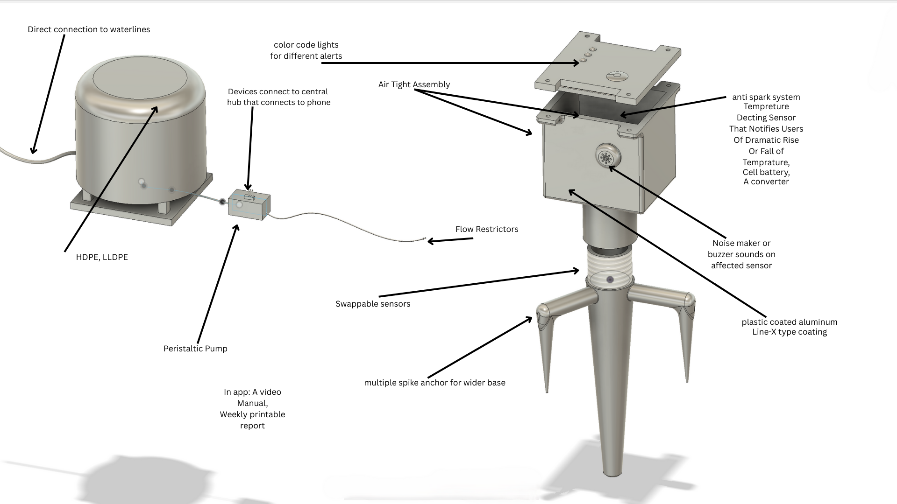
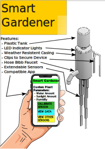

## Overview

On September 24th, 2025, our group met in the library at approximately 4:30 to discuss our upcoming assignment. We started by discussing how we were going to split this assignment and what we were going to do together. We had decided to make the list of features and rank each idea for the need together and distribute the rest of the work evenly. We decided to take a while and brainstorm different features for our product, as well as rank them based on the different requirements that we had chosen from our previous assignments. During this, all of us contributed to formatting, organizing, and contributing to our excel sheet; which needed to contain a variety of user requirements and needs, as well as ideas of different potential features and details about said features. We had a list of requirements and needs for our plant monitor from a previous assignment, which aided us in coming up with one hundred features for our project as per the assignment guidelines. We took these needs and came up with five unique features for each one. For most of this time, we were looking at the different sections that we could come up with simple and easy-to-make solutions for our product. For the ones that we couldn’t come up with, we turned to the internet and ChatGPT for inspiration. While we mostly got responses with the features we had come up with, it did give us quite a few alternatives and examples of other systems that aided in our brainstorming process. It helped us get ideas for a lot more, and eventually, we had finished our list. We all contributed and made a fair share of ideas for the list, and added details about each idea at a later time. We had some addressing the safety of the product, some that addressed ease of use, as well as some quality of life details. Within these, we addressed the pressing issues of using electronic devices in environments with elements that would cause wear and tear on our system. We addressed how we would deal with potential rain, extreme temperatures, and strong winds that could negatively impact how our device would function in harsh environments over time. For each, we went over different ideas and used ChatGPT to help us generate some ideas for different aspects of the features, such as having a waterproof electronics box. We also had some quality of life requirements, such as an easy-to-use app that allows for multiple systems to connect and work in tandem. These aren’t necessarily needed; however, they are qualities that will set us apart from other options. After we had come up with one hundred user needs, we decided to start ranking the features 1-5 based on the user needs. At this point, we went through the list slowly as a group and decided which features were better ideas than others. We had a few that were easy to decide on, like how we should make the system to refill the water. Some, however, were harder to decide on, like what flow regulators we wanted to use. Often, we had very similar features that were hard to rank because they were incredibly close, or we didn’t have a preference for one over the other. After doing this, we started working on our assigned roles separately throughout the rest of the week. Three of our members worked on sorting the rest of the features and working on their own designs of the products, while one worked on the documentation of this part of our project. Each of the three members who were working on designs took about 20 features from our list of rankings and put them together to make a unique design. They made physical mockups of their design out of materials they had. They also needed to make an electronic vector-created version of their design. For this, they also need to highlight the different features of their project, showcasing the different features that they chose for their project, incorporated into their design.
 
>Written By: Rylee Wirt
 

## Generating Ideas

For our top 20 product requirements, we brainstormed 5 different product features that could be used to satisfy those requirements. This table is our initial brainstorming, which was originally done in a Google Sheet. 

| Requirement / Needs | Features | Detail |
|---------------------|----------|--------|
| The product’s sensors shall be resistant to the effects of weather and rain for at least 12 hours of weather. | Electronics Cover | A cover for the electronics will keep water from getting on them. |
| The product’s sensors shall be resistant to the effects of weather and rain for at least 12 hours of weather. | Resin Sealed Electronics | |
| The product’s sensors shall be resistant to the effects of weather and rain for at least 12 hours of weather. | Air-Tight Assembly | |
| The product’s sensors shall be resistant to the effects of weather and rain for at least 12 hours of weather. | Hydrophobic Product Cover | |
| The product’s sensors shall be resistant to the effects of weather and rain for at least 12 hours of weather. | Dielectric Greese | |
| The product’s watering system shall not leak water within the expected lifespan. | Solid Plastic Tank | |
| The product’s watering system shall not leak water within the expected lifespan. | HDPE, LLDPE | |
| The product’s watering system shall not leak water within the expected lifespan. | O-Rings at Connection Points | |
| The product’s watering system shall not leak water within the expected lifespan. | Fiberglass Reinforced Plastic Tank | |
| The product’s watering system shall not leak water within the expected lifespan. | Concrete | |
| The product shall not spark or ignite upon exposure to weather conditions like rain or heat waves. | Coolant System | |
| The product shall not spark or ignite upon exposure to weather conditions like rain or heat waves. | Ventilation | |
| The product shall not spark or ignite upon exposure to weather conditions like rain or heat waves. | Tinted Glass Box | Box with UV-protecting tint to stop sun and rain. |
| The product shall not spark or ignite upon exposure to weather conditions like rain or heat waves. | Anti-Spark System | |
| The product shall not spark or ignite upon exposure to weather conditions like rain or heat waves. | Waterproof | |
| The product’s water tank should be refillable without removing it, and take less than 1 minute to refill. | Removable Lid | The receptacle has a lid you can remove for easy pouring access. |
| The product’s water tank should be refillable without removing it, and take less than 1 minute to refill. | Water Cooler Bottle | |
| The product’s water tank should be refillable without removing it, and take less than 1 minute to refill. | Condensation Collection | |
| The product’s water tank should be refillable without removing it, and take less than 1 minute to refill. | Rainwater Collection + Hose Attachment | |
| The product’s water tank should be refillable without removing it, and take less than 1 minute to refill. | Direct Connection to Waterlines | |
| The product’s sensor readings shall be accurate to the real value of the measurement, with a tolerance of 5%. | Recalibrates Every Month | |
| The product’s sensor readings shall be accurate to the real value of the measurement, with a tolerance of 5%. | Filter System | |
| The product’s sensor readings shall be accurate to the real value of the measurement, with a tolerance of 5%. | Scheduled Maintenance | |
| The product’s sensor readings shall be accurate to the real value of the measurement, with a tolerance of 5%. | Environmental Control | |
| The product’s sensor readings shall be accurate to the real value of the measurement, with a tolerance of 5%. | Provided Test Kit | |
| The product shall be manufacturable using weather-resistant materials while maintaining the price point. | Layered Plastic Sheets | |
| The product shall be manufacturable using weather-resistant materials while maintaining the price point. | Steel | |
| The product shall be manufacturable using weather-resistant materials while maintaining the price point. | Aluminum | |
| The product shall be manufacturable using weather-resistant materials while maintaining the price point. | Extruded Plastic | |
| The product shall be manufacturable using weather-resistant materials while maintaining the price point. | Plastic-Coated Aluminum | |
| The product shall have an operating temperature ranging from -40 to 140 degrees Fahrenheit. | Aluminum Build | |
| The product shall have an operating temperature ranging from -40 to 140 degrees Fahrenheit. | Lithium-Thionyl Chloride or Similar Batteries | |
| The product shall have an operating temperature ranging from -40 to 140 degrees Fahrenheit. | Temperature Detecting Sensor That Notifies Users of Dramatic Rise or Fall of Temperature | |
| The product shall have an operating temperature ranging from -40 to 140 degrees Fahrenheit. | Thermal Protection on the Circuits | |
| The product shall have an operating temperature ranging from -40 to 140 degrees Fahrenheit. | Use Components Suited for Those Temperatures | |
| The product’s app shall allow the user to create custom plants with custom parameters for the sensors. | App Edits Variables in Microcontroller Code | |
| The product’s app shall allow the user to create custom plants with custom parameters for the sensors. | Plant Care App with Personality-Based Parameters | |
| The product’s app shall allow the user to create custom plants with custom parameters for the sensors. | Microcontroller Has an Open Source Library of Plants | |
| The product’s app shall allow the user to create custom plants with custom parameters for the sensors. | User Setup Menu to Adjust Variables | |
| The product’s app shall allow the user to create custom plants with custom parameters for the sensors. | Device has a Built-In Screen That Connects to a Microcontroller. | The User can enter values directly into the sensor. |
| The product shall have a battery life of at least 6 months. | Cell Battery | Use something like a laptop battery, but with bigger cells to allow for longer battery life. |
| The product shall have a battery life of at least 6 months. | Connect to Power Grid | Plug the device into something more long-term, like an outlet. |
| The product shall have a battery life of at least 6 months. | Connect the Batteries in Series | Connecting batteries in series allows them to run for longer than if they were run in parallel. |
| The product shall have a battery life of at least 6 months. | Smart Sleep Mode to Preserve Battery | |
| The product shall have a battery life of at least 6 months. | Solar Panel Connected to Battery | A solar panel connected to a battery would partially supply energy for the product. |
| The product shall offer both a DC and an AC power supply. | A Converter | Having a converter to change the power type and a switch to change which path it's going. |
| The product shall offer both a DC and an AC power supply. | Backup DC Battery and a Main AC Connector | |
| The product shall offer both a DC and an AC power supply. | Wind Turbine with DC Generator and Backup AC Plug | |
| The product shall offer both a DC and an AC power supply. | Piezoelectric Kinetic-to-Electric Generator | |
| The product shall offer both a DC and an AC power supply. | Bike Generator to Charge AC and DC Batteries | |
| The product shall not move when rooted in soil, under the influence of 15 miles per hour winds. | Weighted at the Bottom of Sensors | |
| The product shall not move when rooted in soil, under the influence of 15 miles per hour winds. | Water Lines: Anchored Every 6 ft, Sensor: Spike Anchor Low Above Ground Profile | |
| The product shall not move when rooted in soil, under the influence of 15 miles per hour winds. | Multiple Spike Anchor for Wider Base | |
| The product shall not move when rooted in soil, under the influence of 15 miles per hour winds. | Buried Waterlines | |
| The product shall not move when rooted in soil, under the influence of 15 miles per hour winds. | Clip for Pots | If the plant is in a pot, a clip for the sensors will keep it secure. |
| The product’s connections shall be able to work in parallel with other devices. | Multiple Device Section in App | The app allows you to control multiple devices. |
| The product’s connections shall be able to work in parallel with other devices. | Products Can Connect Together via WiFi or Bluetooth | Once products are manually connected to WiFi/Bluetooth together, they stay connected. |
| The product’s connections shall be able to work in parallel with other devices. | Devices Connect to a Central Hub That Connects to the Phone | |
| The product’s connections shall be able to work in parallel with other devices. | Devices Have Built-In Buffers to Prevent Interruptions | |
| The product’s connections shall be able to work in parallel with other devices. | Connections Have Specific Frequencies | |
| The product shall include LED lights to alert the user as to its current status or activity. | Lights on the Electronic Box | LED lights on the electronic box alert the user to its status (on/running). |
| The product shall include LED lights to alert the user as to its current status or activity. | Lights on the Sensors | Little LED lights on the sensors alert the user to their power status. |
| The product shall include LED lights to alert the user as to its current status or activity. | Color-Coded Lights for Different Alerts | |
| The product shall include LED lights to alert the user as to its current status or activity. | App Has Color-Based Indicator | |
| The product shall include LED lights to alert the user as to its current status or activity. | Morse Code Lights to Spell Out Current Activity | |
| The product’s casing shall be given a finish for weather resistance and a comfortable feel. | Plastic Casing | |
| The product’s casing shall be given a finish for weather resistance and a comfortable feel. | Nylon | |
| The product’s casing shall be given a finish for weather resistance and a comfortable feel. | Silicone | |
| The product’s casing shall be given a finish for weather resistance and a comfortable feel. | Line-X Type Coating | |
| The product’s casing shall be given a finish for weather resistance and a comfortable feel. | Polyurethane | |
| The product shall have a range of functional sensors available in 3-inch, 6-inch, 9-inch, and 12-inch lengths. | Swappable Sensors | |
| The product shall have a range of functional sensors available in 3-inch, 6-inch, 9-inch, and 12-inch lengths. | Extendable Probes | |
| The product shall have a range of functional sensors available in 3-inch, 6-inch, 9-inch, and 12-inch lengths. | Multi-Pack with Several Sizes | |
| The product shall have a range of functional sensors available in 3-inch, 6-inch, 9-inch, and 12-inch lengths. | Strong Programmable Sensors | Sensors that can be programmed for different lengths. |
| The product shall have a range of functional sensors available in 3-inch, 6-inch, 9-inch, and 12-inch lengths. | IR Sensors | |
| The product’s app shall notify the user if a crash or unexpected outage occurs, providing the date and time. | App Gives Crash Logs | |
| The product’s app shall notify the user if a crash or unexpected outage occurs, providing the date and time. | Screen with Time | Device has a screen that shows the last time the device was working. |
| The product’s app shall notify the user if a crash or unexpected outage occurs, providing the date and time. | Noise Maker or Buzzer Sounds on Affected Sensor | |
| The product’s app shall notify the user if a crash or unexpected outage occurs, providing the date and time. | Phone Call When Device Stops | |
| The product’s app shall notify the user if a crash or unexpected outage occurs, providing the date and time. | Sensor Auto-Ejects from Soil and App Indicates Which Sensor Is Out | |
| The product shall include a manual that provides enough information so that a moderately experienced user can diagnose and solve an issue in under 30 minutes. | A Video Manual | |
| The product shall include a manual that provides enough information so that a moderately experienced user can diagnose and solve an issue in under 30 minutes. | A Diagnostic Scanner That Identifies and Alerts the User | |
| The product shall include a manual that provides enough information so that a moderately experienced user can diagnose and solve an issue in under 30 minutes. | A Booklet Manual | |
| The product shall include a manual that provides enough information so that a moderately experienced user can diagnose and solve an issue in under 30 minutes. | A Downloadable PDF Manual | |
| The product shall include a manual that provides enough information so that a moderately experienced user can diagnose and solve an issue in under 30 minutes. | A Neuralink Connection That Alerts the User | |
| The product’s app shall record readings and store data in user-readable graphs. | Histograms Stored in App | |
| The product’s app shall record readings and store data in user-readable graphs. | Heatmap of Most Common Readings | |
| The product’s app shall record readings and store data in user-readable graphs. | Pie Chart Stored in App | |
| The product’s app shall record readings and store data in user-readable graphs. | Weekly Printable Report | The app sends a report to the printer every week, giving a report of how each plant is doing, complete with statistics, general information, care instructions, and a highly detailed graph. |
| The product’s app shall record readings and store data in user-readable graphs. | The App Allows Exportable CSV, PDF, and Image Files | |
| The product shall not produce more than 40 decibels of active noise. | Put the Pump in a Soundproof Box | |
| The product shall not produce more than 40 decibels of active noise. | Use Pumps That Make Less Than 40 Decibels of Sound | |
| The product shall not produce more than 40 decibels of active noise. | Components Can Be Mounted on Vibration Absorbing Materials | |
| The product shall not produce more than 40 decibels of active noise. | Centrifugal Pumps with Magnetic Drive | |
| The product shall not produce more than 40 decibels of active noise. | Peristaltic Pumps | |
| The product’s watering system shall be consistent with its dispensing volume within the expected lifespan. | Hose Bibb | A valve that allows a certain amount of water through before closing. |
| The product’s watering system shall be consistent with its dispensing volume within the expected lifespan. | Pressure Regulators | Control the pressure going to the dispersal device. |
| The product’s watering system shall be consistent with its dispensing volume within the expected lifespan. | Flow Restrictors | Control the amount of water going to the dispersal device. |
| The product’s watering system shall be consistent with its dispensing volume within the expected lifespan. | Self-Flushing Nozzles | |
| The product’s watering system shall be consistent with its dispensing volume within the expected lifespan. | Anti-Clog Nozzles | |

## Ranking

The following table is our ranking of the features, based on the method covered in the Overview. This was originally done in the same Google Sheet as before. 

| Requirement / Needs                                                                 | Features Ranked                                                                 |
|--------------------------------------------------------------------------------------|---------------------------------------------------------------------------------|
| The product’s sensors shall be resistant to the effects of weather and rain for at least 12 hours of weather. | 1. Hydrophobic Product Cover 2. Air Tight Assembly 3. Electronics Cover 4. Resin Sealed Electronics 5. Dielectric Grease |
| The product’s watering system shall not leak water within the expected lifespan.     | 1. O-rings at Connection Points 2. HDPE, LLDPE 3. Solid Plastic Tank 4. Fiber Glass Reinforced Plastic Tank 5. Concrete |
| The product shall not spark or ignite upon exposure to weather conditions like rain or heat waves. | 1. Waterproof 2. Anti Spark System 3. Tinted Glass Box 4. Coolant System 5. Ventilation |
| The product’s water tank should be refillable without removing it, and take less than 1 minute to refill. | 1. Removable Lid 2. Water Cooler Bottle 3. Direct Connection to Waterlines 4. Rainwater Collection + Hose Attachment 5. Condensation Collection |
| The product’s sensor readings shall be accurate to the real value of the measurement, with a tolerance of 5%. | 1. Provided Test Kit 2. Recalibrates Every Month 3. Scheduled Maintenance 4. Filter System 5. Environmental Control |
| The product shall be manufacturable using weather-resistant materials while maintaining the price point. | 1. Plastic Coated Aluminum 2. Extruded Plastic 3. Aluminum 4. Layered Plastic Sheets 5. Steel |
| The product shall have an operating temperature ranging from -40 to 140 degrees Fahrenheit. | 1. Use Components Suited for Those Temperatures 2. Thermal Protection on the Circuits 3. Temperature Detecting Sensor That Notifies Users of Dramatic Rise or Fall of Temperature 4. Lithium-Thionyl Chloride or Similar Batteries 5. Aluminum Build |
| The product’s app shall allow the user to create custom plants with custom parameters for the sensors. | 1. App Edits Variables in Microcontroller Code 2. The microcontroller has an Open Source Library of Plants 3. User Setup Menu to Adjust Variables 4. Plant Care App with Personality-Based Parameters 5. Device Has Built-in Screen That Connects to Microcontroller |
| The product shall have a battery life of at least 6 months.                           | 1. Cell Battery 2. Connect the Batteries in Series 3. Smart Sleep Mode to Preserve Battery 4. Connect to Power Grid 5. Solar Panel Connected to Battery |
| The product shall offer both a DC and an AC power supply.                             | 1. Backup DC Battery and a Main AC Connector 2. A Converter 3. Wind Turbine with DC Generator and Backup AC Plug 4. Bike Generator to Charge AC and DC Batteries 5. Piezoelectric Kinetic to Electric Generator |
| The product shall not move when rooted in soil, under the influence of 15 miles per hour winds. | 1. Multiple Spike Anchor for Wider Base 2. Clip for Pots 3. Weighted at the Bottom of Sensors 4. Water Lines: Anchored Every 6ft, Sensor: Spike Anchor Low Above Ground Profile 5. Buried Waterlines |
| The product’s connections shall be able to work in parallel with other devices.       | 1. Multiple Device Section in App 2. Products Can Connect Together via Wi-Fi or Bluetooth 3. Devices Connect to Central Hub That Connects to Phone 4. Devices Have Built-in Buffers to Prevent Interruptions 5. Connections Have Specific Frequencies |
| The product shall include LED lights to alert the user as to its current status or activity. | 1. Lights on the Electronic Box 2. Color Code Lights for Different Alerts 3. Lights on the Sensors 4. App Has Color-Based Indicator 5. Morse Code Lights to Spell Out Current Activity |
| The product’s casing shall be given a finish for weather resistance and a comfortable feel. | 1. Polyurethane 2. Line-X Type Coating 3. Silicone 4. Nylon 5. Plastic Casing |
| The product shall have a range of functional sensors available in 3-inch, 6-inch, 9-inch, and 12-inch lengths. | 1. Extendable Probes 2. Swappable Sensors 3. Multi Pack with Several Sizes 4. Strong Programmable Sensors 5. IR Sensors |
| The product’s app shall notify the user if a crash or unexpected outage occurs, providing the date and time. | 1. App Gives Crash Logs 2. Noise Maker or Buzzer Sounds on Affected Sensor 3. Screen with Time 4. Phone Call When Device Stops 5. Sensor Auto Ejects from Soil and App Indicates Which Sensor is Out |
| The product shall include a manual that provides enough information so that a moderately experienced user can diagnose and solve an issue in under 30 minutes. | 1. A Downloadable PDF Manual 2. A Booklet Manual 3. A Video Manual 4. A Diagnostic Scanner That Identifies and Alerts the User 5. A Neuralink Connection That Alerts the User |
| The product’s app shall record readings and store data in user-readable graphs.      | 1. The App Allows Exportable CSV, PDF, and Image Files 2. Histograms Stored in App 3. Weekly Printable Report 4. Heatmap of Most Common Readings 5. Pie Chart Stored in App |
| The product shall not produce more than 40 decibels of active noise.                 | 1. Peristaltic Pumps 2. Centrifugal Pumps with Magnetic Drive 3. Use Pumps That Make Less Than 40 Decibels of Sound 4. Put the Pump in a Soundproof Box 5. Components Can Be Mounted on Vibration-Absorbing Materials |
| The product’s watering system shall be consistent with its dispensing volume within the expected lifespan. | 1. Hose Bibb 2. Flow Restrictors 3. Pressure Regulators 4. Self-Flushing Nozzles 5. Anti-Clog Nozzles |

## Product Concept Designs

The following table shows the features that went into each of our product designs. This was done in the same Google Sheet as before. 

| Name   | Product Title     | Features |
|--------|------------------|----------|
| Isaiah | Smart Irrigation | - Air Tight Assembly - HDPE, LLDPE - Anti-Spark System - Direct Connection to Waterlines - Scheduled Maintenance - Plastic Coated Aluminum - Temperature Detecting Sensor That Notifies Users of Dramatic Rise or Fall of Temperature - User Setup Menu to Adjust Variables - Cell Battery - A Converter - Multiple Spike Anchor for Wider Base - Devices Connect to Central Hub That Connects to Phone - Color Code Lights for Different Alerts - Line-X Type Coating - Swappable Sensors - Noise Maker or Buzzer Sounds on Affected Sensor - A Video Manual - Weekly Printable Report - Peristaltic Pumps - Flow Restrictors |
| Jacob  | Smart Gardener   | - Electronics Cover - Solid Plastic Tank - Waterproof - Water Cooler Bottle - Recalibrates Every Month - Extruded Plastic - Use Components Suited for Those Temperatures - App Edits Variables in Microcontroller Code - Smart Sleep Mode to Preserve Battery - Backup DC Battery and a Main AC Connector - Clip for Pots - Multiple Device Section in App - Lights on the Electronic Box - Polyurethane - Extendable Probes - App Gives Crash Logs - A Downloadable PDF Manual - Histograms Stored in App - Use Pumps That Make Less Than 40 Decibels of Sound - Hose Bibb |
| Raunak | GORDO            | - Electronics Cover - Solid Plastic Tank - Waterproof - Removable Lid - Provided Test Kit - Extruded Plastic - Use Components Suited for Those Temperatures - App Edits Variables in Microcontroller Code - Smart Sleep Mode to Preserve Battery - Backup DC Battery and a Main AC Connector - Weighted at the Bottom of Sensors - Multiple Device Section in App - Lights on the Electronic Box - Polyurethane - Extendable Probes - App Gives Crash Logs - A Downloadable PDF Manual - Histograms Stored in App - Use Pumps That Make Less Than 40 Decibels of Sound - Hose Bibb |

Here are our product design sketches based on the features from the above table. 
### Smart Irrigation

>Design By: Isaiah Johnston
 
 
### Smart Gardener

>Design By: Jacob Alger
 
To see this design in PDF form click [*here*](../resources/Smart Gardener Concept.pdf) and to download the SOLIDWORKS CAD models click [*here*](../resources/Smart_Gardener_Concept.zip)
 
 
### Gordo the Garden Buddy

>Design By: Raunak Singh
 
 

## Chosen Design Idea
As a team, we decided to move forward with something resembling a bit of each good idea we had from all of our designs. We decided to make our design ideas in isolation, so that our individual ideas would shine through, and then as a team we could pick what we liked best from each one. For example, we picked the name "Garden Buddy" as it was the catchiest name that we came up with through our individual design ideation process. Overall, our final design will mirror a bit of each, and will most likely continue to evolve as our project progresses.
