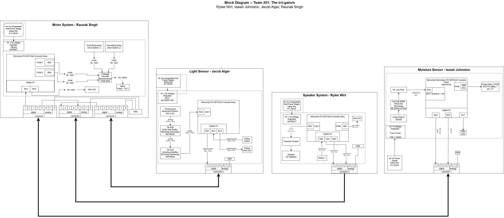

## Introduction

To gain an understanding of our product and how each of us will contribute to its functionalities, we created a block diagram based on the Hub-and-Spoke template provided. Each block represents one of our team members' PCBs and how they will all connect. We chose the Hub-and-Spoke Design because our device is centered around its auto-watering functionality, and we want the motor to be the hub of operations. Then the light sensor, moisture sensor, and speaker can all work based on the connections defined by the motor subsystem, to both control it and receive signals from it. You can view our block diagram below in **Figure 1**.

## Block Diagram
You can view this block diagram in draw.io ["here"](https://viewer.diagrams.net/?tags=%7B%7D&lightbox=1&highlight=0000ff&edit=_blank&layers=1&nav=1&title=team-block-diagram-hub.drawio&dark=auto#R%3Cmxfile%3E%3Cdiagram%20name%3D%22Page-1%22%20id%3D%22D7A3hRXi8sjnXgM3Vncy%22%3E7T1Zc5vI1r9GVckDKpqlgUdLthNn7ERjO5O538tXWMISY0noIsnL%2FPpLI0DQfdgEzeI4VSkbDBKcfT8Debx6%2FeKam8WNM7OWA0mcvQ7k84EkqTrWvR%2FkzNvhjCyJwZm5a88O59DxxJ39rxWcFIOze3tmbRMX7hxnubM3yZNTZ722prvEOdN1nZfkZY%2FOMvmtG3NuMSfupuaSPfvLnu0Wh7O6Kh7Pf7Xs%2BSL8ZiQGf1mZ4cXBie3CnDkvsVPyxUAeu46zO%2Fy2eh1bSwK9EC6H%2By5T%2Fho9mGutd0VuuFitVhN1%2BoL%2FdSbGy1%2BTt%2FPFXECyfPicZ3O5D145eNzdWwgDa%2BaBJDh03N3CmTtrc3lxPDtynf16ZpEvEr2j4zXXjrPxTiLv5D%2FWbvcW4Nfc7xzv1GK3WgZ%2F3e5c5ymCsOqdsdazM4I%2F73C6NLdbe3o4eWkvjzeZ7o69yD8du8yDj%2Fv2N3m2oRoe%2Fif%2Bt%2FPX4MEPR2%2FBEQvgAOYEHrETAbi%2FWM7K8u73LnCtpbmzn5MkZAaUOI%2BuC2713sB8i12wcez1bhv75Ak54V0QcBXSQpJ6C3lFoVBP3SFE9Jpyh%2FfL4SnS7leMoaHrBkaaomNZxolPU8LnCd%2FAQ8Dc2gUfkvFczJtoGvVJW2fvTi3mk7xfYgA%2FnvJJHib%2F2Z14%2Bzy6HcnXy%2BvnPVb%2BsC1FQKF8SpA%2FXnr4Hs3s5wQb4P%2FuCauOlvbaEhYBz595l%2Fgsr%2FoEE17j%2FTYPfvqftQlPGH95N%2Fh3%2FVy71nzv0YnHNpL4y%2FQfduK8WK73826%2F2SzfwrsfXPrzthtzDT7cgzl9mvvcKEydpeMennDnmuttSMgjX1pGf1uSFxFmpvv0yZ0%2FfPJexQOlGP74fPhJ%2FiKp6uEg%2Fsvnz%2BB735kri7zGU8Y7eAg7vEa%2FXm3yTUCidPY15zW80xvgnE9U4VlKzCaF6MvC3ll3G3NK%2FvriadekwFw5z%2BaDfyc5cq2t%2FW%2F82NmZu9ixp5at%2BLE1s%2BOHS2f6FH1xoEljf04VhM%2BWu7NeM0VhKEEQoiRQKJFejlo1OreIaVSdkghx8ZkQBxm8vxh9%2Ff5d%2BjV259Lu6%2Br7D0ub7QXp3Su%2Bw2ePDwxxPrMezf1BstHU8GrvDvoR63pw%2FB%2F%2F2DCM4PioI8lBqCJPVa3kQyaWa3uYtNw8dXvQJgH29W%2FPr6vrvfh99PTt%2Bo%2F519GlLiBN46KYWT2oakkqVoxTNZ9IfZKmFNN8pY0FERuJLzLUHFsBIzXrhqSpcIIi%2FvLf3dM%2Fwt9oevXH82T%2BLxZfJ7aAfwMzNOIyNcZjKJO%2FCnNw3SbugfqyLKeQXvO5U1Yb4k7ZoLgTn8idkmEQ0Rf9U5McUdRKLcurka4LvkcPvjeVVWVDybqhMqvCmJeVVJv50fGfjzXeyB%2BErc92xDLzaO4102B%2BCE9c%2B5aAZ0pa661DTGPB%2B%2F%2FNnDreFeLZck7M5ci6egAsrsMj1WFyPXq8HLLi2lkTgUMMIHtqLs88U3Ptnd4ROdN%2F2wyxthnWANsM0wx2inGWQmRqvkKoir2ZuV34t%2FfSoBaTSJMAgxpDBjUjFWtEGmaQdmNPXWe6sDfEu70aI%2F1S1f5UPG0vjveu7WztHXmp7%2BbaqYZemBMBpPcMz4iK3MgAb0oYQHMUQeWAZi1VAST823I6AaXphJk994C%2BJB616ZrLJQkxp4h32M%2Fm92if1L%2F8eAE2V4Tc1g9b8gMRWrfXn0s%2BZvPmbmiShr%2F%2FJ2Ge1uvyEQgED6J3hQ3zrVxZZ63clEiiXNDKDQW4OJQNOfDNTrV8w0ucx8etxSdCKrMR0nPrYT8H2Gq03%2B2cdd%2BjXTPb9U7YDtEiL9Z2l0VAxeW4IifluKoA6hrS1vykuJFvYZF4a2cs2uSlgyixVhwJEmUzaYAyRRAW%2BJlMIX5jWAje0%2Fd25HqtogfH49BV6wjNIch8fLaIL8TgK7JPPjDFYir0TgBGEyGrlR%2Fi2Hi%2F6dlKzvwDb1nuB%2B1lsnhUmkUjGyhG1TDYc0TF%2FcBmMcGGASuGaHqOiddBGos0jBg2dFbRjHgfiAEs7oYRw4bHlA%2FEHK219hDDBrTUD8Qc81HtIYYNPuAPxMTMsvYww0YPtA%2FMeH9tXf2rbERB%2F8CM99fW9b%2FKeiotBfmzq07iIf5DAVgY5BeHoqgNsgP9%2FlF%2BcVc2WgvUnwQaOj8yH4Zs6qs%2FqUgGbCSCZ44qjHJ0JWUmCu8jaZas44qY6CNphlS5KGvioqVhx6SZKBrBTZWLOQfxyJZCF3XlFos1kHxTobJIhjcnC2fnEGrY%2BkmDghx9Nns211O%2F%2B8D%2FgLX9mluD7xsKwvZgKZxtXAus4BpIspFk2ZQK%2BWIiBzhV8AEJAbuWf5%2FI%2FGXtuCtzCcqo%2Bt7h%2B921oPoSP%2BuGvqZKzSDoPfVkBFH1nHKngp5kVRnqHQg99mbSQGp6DeSHDu%2BBDj9RHydKvYOCsnidd6j4y9oH%2FdTzuLAJHurWMsUxGCn16HmqxxCHpaWlezboUjxMfVBKGXizFgNUN8tIgkQFT67cuPWNhOuL877rq2ZKezAQnGu2tEdlEw0fBZq91FMn9AxFui1SZrGyznfna2KlqA5SS%2Fqa4lBRJKkeFYS0pAWLpWKqo3wHkUF9T6E2%2Fyb0EptiOzsfVyzdCP0P9yBUu0GzFWr7gUSoDigOlZ%2FiYPNtt2diNST1HSkaixSo5Enmh5Tfr1AXaUk5pkAlAjKABX4eP2bTaueh3SNeeZ%2F5oxqb9KS7MIdEi8d0DAah0ac0hFC2kvf2%2FB3msMvjBqGkBGR5TwYwxU8AAsMBbsesDPwNMUXrqrZVFU4Pi8bD57djOTWwXgWpS%2FPBWo6iOUGd6vysC%2BVG11BeKOCU69DzHtv0gzQgn6023CMTvF%2Fk08%2F1oWf6i2mTHNho%2F%2FhouZ%2FpEEfv3zPeOH5vTRdr7%2Fvmb3W9VmoC0Q8sPZore%2Fl2eLlb58HZOYenFczNZmkJ27ftzlodTpFxcE835vTOP3fpPxM5%2F9VaPlvEejscnrk2MRTJr1tzvRW2lms%2F%2Bs8j0qEsaagHwSzREwk7IXByfUBbjzsQWO1jazzBoijlo6dIFrUver2ZbKcCOKBwtlPlJuObjSd%2FZDt5ZTsHpSLCpbKdg%2BIjBPoZaQ7ZsECkOYiiFY80iyoKWKxipDkqizzOW05%2BRNFkp0DNBML0OJHa5tNR36Nkz7yir5f1jJFXjUa4MTQVpeaIUL8nFhUZAWoAzgviV5Ktt1qSfVJajypZOYrt9LTeZWDPnh%2Bt0oQURlJwzE4apMmqggDFxWepGAUFaEMV2xiKwEeTnQvNiCYkrLK2BTEsRDRUyTV%2FOcsdmUbv%2BRyHydDHYs7%2BTYC%2BGY%2FZh78Za7qoju%2BF0STfJdj0zyGoRUoWmOuGoL6VOgYlZ1s%2BHyGehkI8V2s%2F9bOeH15oaT%2FahxBPpffKjah8hE4%2BQifvKnSCoflOUOiE7v2oUXa%2BewOzikUITHjPHvvS8uoVifGKs73VnOsHfAY0a1K2vgaE3AlysY3q0GafnHfx6DVJVw7Airaoo4auAVnZs9lBRsTkM2HDgHS9D1dHA%2FUcZMxsEVW9bEfwRIeKtATJh3s2Kga25MSHhtWEDYR1NHbgxDtrMo2tOAjCTMf9BhUFfOi78B79L1OFELjgXo76qIQtnPzy%2FbyaPVaDQSTTvS9ALgkcHl2DPQTum5OlnNnRpST8AyeN4BkCsEbwzVrvgnPbnLvmivg1gu9N%2Bb97quRw%2F%2F2CRHGuXNcW5iSMs83XFQ9ta8HUd771biSv88t2Awftamva5sL75ZuzWG%2F9kb%2FkNLWVgZy6NfdrkwDsznNmFzlQIHGiAtoab17T3zZH6xKvMMlkyQ0rgfwDIu%2FFFTPE1Um%2Bj0decT2MLonJglkh4vw4p%2FMalQrvfUFQ2KjmhEgNoBOQSNVUCVEWIgY8Ayw3rmPIfgr02PLUatBL5I64gZJaayUACkeHcjyyWkP1QgokIXeof5BEwDQ2BNX6IW5EKYkdMoZbjGak0FkAnPyNWIULBGrPb2U%2FeYxDfni06tozT%2FFfHuKzW%2BIhLizf%2FAkH%2FYuf0OfWbVxBxWQqzPFfsnpdUJO7vAwds2wkJT8h%2FIjkrqOhxgsBEmIlUufXfyS4KreWqApfaYX5qvY9kBX5qtSinHh8%2F6sw8riPJIOrzZ%2B5NG13urCXM2KDWyt76qxn%2B2mZMUGXZ991JIrfeWQcsuv165ANCqVFkawNtTinS4ww0IxhWMqTNPWGssSNUHLWUAeZIqcM4iYeNJf7gb8xD64N73oNgSQTidtY%2FqsOeotaeMPsPRKHSGZNYMgCNoa6xovAJMibaHbQRy2qXsVDHeuGKusKjoYwhbCW1KFmeEpANxRNxno4oD4Od3K7ZwGIKpJ0SVQBPS8TPS%2BqEpaDT%2BKGkgJuyaGtNw1wNQTsDUUdilhRdFHXFDkq0QqLKxU8PIIz6gtMDFAlVItEWZdUJONoZk8iuSoPvXuPIOXm6Elsn2B8l07FYQOpmz5Y%2FOQgvORShy5BmO3v47v9hgNsQ2mhDEOyDgDHEDeS0RBhQzZ0Q%2FQxAJgFaR%2FDAfZsox3XBTYcQP%2BaDdfimFGloYI1TTVULOkKUsPFoy1hhnWfK8oaziIFDyXZg7qh6UiRRC2U%2Bi1Bj3WSKsbn%2BFFuGuS6C1zWsai4C4YfcNOYurvAZcvCK%2B5z4QdcTff8XoRlQ1YUCUuhK9tZ2Mps8qjiShaO%2BkxUhoasqsjwlDTWZVHrOnBZb7DiWpXmjYXuApf16ypOleEIXFUbKqLsSQes66qkYNZl7hhwWRev4nITjsDV5SGWNaTqCjY8R1tm7diOARea3tJ0REIxjKHoE6NqEIWlJ4M8PQtJyKzT1sR636JEHWG8vyEJmXW%2BuhGSKAHbvoYkZNZ160RIogTo32lIQmb9voZCEieKlG4pQtaxaygkUZ5yexeSADbeNxSSKA%2Fc3oUkgPX0DYUkygO3byEJYIN8QyGJE%2FRZ30ISwF73hkIS9RkL3QUu69g1FJI4Abh9C0kA69YbCkmcANy%2BhSQUFpQfhZFRuSMwkSzlym60Twsa1Y8WplBSp5AxN%2BSMBxOwkXlD5Y7rFDI1%2BkKmFchNKV6HW3TVCm9yk5nqzxxyo28wFP7UIyHW%2F%2Bko9aQJOYmnlAO2yWaXW3el%2FBvY3jr5dQPUXX5Snw%2B1sGiTHCxQrpexzh7FVISVCOVjjbReqHL4T6JkPx7KsWpNxAYuVH2oyAo%2B%2FgNGtzRVrykh1pHuGZdqPLkU2AXZEy4tNMA%2BxrhJvqR5t39cqitDzfO2on9JLtXU4ZG3PD5luRTruc1TzTHpx7ilDEovbMChjjUoAtvjIr6TPL7b9pHxZIyGhh5jvOSMG8%2B98%2Fgq5mUzjKeT%2B4%2FqVQbSsI0xntiqo34i40mNcR4w%2BrYn2pFNJP5WNqzHXsn24QSP%2Bix65C%2BdTWF0Sjl%2BBNPSCR2aRZjdS9cVFgUW2fXfKKVcx2RPvyQZQ0WMhaDZMDY2hmDoWvaIyIgXJincNCKbYum%2BRmxKIWKpKLfh2kPXFblNYrit4KwMqQOzMuhd9YWmYyBo8hHPcRhiq%2BH0E1lHa4x3ehsQBRZ5%2FlbGpEJNaVMo5mNT3R0yH6NNj13gSrEoV5aahFqBKcNqlQLJsdrNx9OSY4ZEN%2FtrFI3wyJTiDllFpxERR8kuFw4ThANE2iYiRU%2BGi2UpJz%2BviVrWDYOU%2FV3H2%2FWhcSzHpAg40Roi0tNU6psBnELafbRamiJtaHteypUdc6%2BB7TcG2drkzz36uXYPu5r8yTm%2FTP%2FzJs4LGYAr3u03m%2BVbfLxtwU0qdQ9WEosNdKLnL92ZKzL49%2B4p4x1S5jJ1%2FdUm3wQkSmdfU18j1VFDzThqSMRkMk%2FSWUOaPJT0mMEIjjJkTUTdu83gxh9s%2BCm%2B1ew52mrm0lvNYsb8%2FdnFt6vUGXPM5dc3ZJHYfVfHVLHDW4u42eCAYW7zhYElIV2YWC9Es9FCrU5cIBZa4AQ1cahgbvBqtUjrRMO1XIKrlkUQ2UXSBdS%2F1A3LVg5HQ4Z0iKgZsTjb0JWoSYDZ93PytrRWa5ZOJNpygTSORCsXDrR1hWg1JenTS0ZJoqXKrbPv50W0vY8ztUizeuEaH040CxAVZfyEBXehYJSlocrSWPmN5aqkDmVJUkTF73ChviUnOFDTOnMhykWG3xs0aWQ9dfIGMecGSRGzbuDFlOyYBYZLuc8GobtBZIU1DDs1nEJj69bi4z9YEDY7JyFCan%2FHfwCLt7ox%2FqMEbCuM%2FwBA31xznsaOSejE%2BI8SoE%2Fr6KUmS%2Fdt%2FIfOxiwbGv9xokjpVNOpzka0KkpqfpTbu%2FEfYY1k8%2BM%2FygO3d%2BM%2FdLbAoqHxH%2BWBS4%2F%2F6Dpo2RkKDU3%2FOEGd9W36h872YDU0%2FaM%2BW6G7wGVdt4amf5wAXHr6R9dhyzp4DQ3%2FOAG2fRv%2BobP%2BRWzz74lrbtOWvQfLlcRDBe%2FAX5tUbn%2FtILHFl6IBtjgRooP6t9HWX8RYcF0qtJlSrSGb%2Be3HN%2FViNPu%2F6y8vV9pkqd69frkX%2Bpiba6yorHDlTajJ2s5i6BJVI4ZyQqKYzdVRJMVjbIfIGtsMGXIPiXoymErZsLwoi%2BLQEGMReGhorKwP4zI9zA5w2HXHgu3GnrrOdGF7kBInV2OkX6ran2QinDjeu7aztXfklb%2Bba6eabqWl5I5wOiRfV85zgBRym2t5%2BiN%2B7OzMXex4Zi2t%2BLE1s%2BOHZGd89IRJlJdQ%2BEdyK0wcFNYx0J4YJg8AWuCEfwlB8xYasJhOACCialEkfQjEZKGKqzo0XUolBWvNn4cBb%2FHK%2B8wf1aAJcAPMNhzAHna%2BYzJzohit%2BokGbqQKGaD9IFUDdYBUWefodiR2FYKSkrVGGomsXsUANMOaEQ6d%2BGxM%2F3bUTOj0NGgm4CezIaiGwccG9W8vmwmOngA%2BQx2q0jHwnCwRILW1RswFl9gIVJF0VHObTgHKHXdWDiC6hsqHdkwwsJHqLkFbAqDtN1kC%2B0%2B7GpTgpRRlyH4DxRAvnXgMuNDYYS2L3w07SIRsFl7o%2Bf%2BVaUwnb%2BudvRuv%2Fnk919H%2BRpCAbTIMXnj79EilAaOxtgcIl1psuRTAsLZc3Gu%2Ft6aLtUdw87cCLjzTznF%2Bg7DiGzj193P0xOfPIceS1RQN00bKjKgqaAvF1dJ63MH44gDDNLXBsh%2FUfsIRwKwfenY%2BRuS7gnor0V4HAxMITMhBHcB3Dy%2FHA9RvSeme28HGDbbAOprbs9qNU47wghIt%2FBQksGDG9%2BnFib2uvcSsLoam2xqU1qEoMVDsShCvLkqFkoKgYqqjxfHn86%2F5%2BHL29Pzw%2BsVZ3E3%2FePg5F1gY345rL3yojURRkkShPI7aJI0ig7X4aifKmbldRF3VLHBLJ6eRTA%2FwB1hdgxptFcQPkKx5VFvVAlMPcePY293e9fv2rfXWL2kglQxXW9M2F94v35zFeutPJIOqFlIKHFqSRSfgn94XAoRtNYiPsMYP%2FwWyCNx9SiwmASMDlkSz4pmtp7y9aMbuOmKkREUlGmpUU4ARZZ7iSSo9Sl01Y0qIfWzxrX8qVwpwgLZz%2BMr2hrpmP3l8zORGOFuRYMto%2F%2FhIBswwcZTUiMzNeIJFSRKIaTkRyJiHTg7OQDLbNM9wGILSwHVIqRREdCEiiCmzRoPgwkt6p8Alu7Wxoi9YogcsB22lImdNw7D95sXK0EsvOwMZVeIHzNa7ESvD8pUCXDpsoXAFP9CG0oZnz1ZdwAMcPiigyBFYwDysrgJLbx1YbJCm9saf2tmyPWixpbO1d5vUBq32GZH1MBuKUJ9mfDQMHdbBYA3bvDzRduPZe97Bo%2F1KYMiRnAAd2DC8WD%2Bg9uqxuoAFxXaaBRbrHLCR9%2B4QF2qfutJjxJsBFCBe2mtLCJ%2BNhIj9d1DZCPFhFie54q9oEudtbBKnuSJwXz9sN8kA8IYOCld8jnvXnDqDaDguv%2B%2B5uyV%2FFSRFFS%2Fg72k9ykF58wpQ39NwFhyodJ%2B4zgMhlgmZbuz9JEA%2FlKpd%2FD2%2BuvdgK0bOaqLygByohN7ah7TB7HMGiuLB9SbcIB3i9TdfwpUdhc2P14bWZVfitUBd5y1hhGvnhfCNud22zw10dNVTylCTCBS2kWto8k4BHGt1fuQvIuAAE0iz8wWd4Qdg1Q%2BlUMj09ruL73cX3eMMRZSKcobCjzNY%2F7Vs3YCeUjbw9erLV%2B%2Bhrn%2F8yplpAIxhTx3tX%2FC7PwVWQ3ytE7RCICc3xXfbk1%2FuazvkLqOmwQkIUy1RioGHwDptJRLKcTJD8lDjR2mtLuXpuE2iFLZJQiO6KzJYZm2SsgLESGHiqO5YFHwHc%2BNXfxarHupqX0t5jlaoSSiS2nr%2FisSg%2FLisBt5LExOyRRa%2BxC4Hlqhkr%2B3IXCMDXJejAqoHkE6wFCghjoFYmwGg3OCH8j4Ov1FwZDX7JvRQJFDPGZruHU0s1%2FbgRhi9qlwPWaWAXNc7JtdZw7ALq1uQhpN9yhhonIFqb%2FmFVeUCs0bYYfwxsCRh2BOvERX2GuWiE59yqtDDcxVXBSCNkq6aSJFGyph%2B4JMo1Yzp7qz6tgGC1a2s6XU%2B%2BkLiQRddYFQjyagqkNnm1RADQqvAJK0Ym06X5nZrT4txqiEqMV71FI0mZfOrd0BrGa5T27I7hOI8nEVoneFgKuKu0nxXnIOpLkyVlgWcObhDW2ha3OaZVbpfwHJqraoafG6olLeegNrd%2Fdn9z7t%2BecA8Ylwa1cam6PownFTbgFMMYp0tkeooI1dQF6Fs5L3MCWFFGhIpbyBZVGRqVI5GN9HVJ6KzXxvg6Fjg4PZc7mrDA5bI0LE0eMpAD62ixuGvhRP%2F6%2BYk07i73Fyvt%2F8%2ByK93%2F2r%2FXLzcYHBOOwND3s0QGFHTsIAIDIYEjIoQGcF0%2FKfwAhMwEINfx%2BfdxjKfDnG9xOhq7wtIMO%2BX7e661%2BvZ7rCVHOIuVbWZQWrcyOv0htLsN6%2FOnMykOoY1VbD7uo7wKPxuwHyP2mk80cbeRdKOKKb4%2BAagwwxEnVxH9C4Fden5q5gSj4rQLj04mMultSycj%2FhEcldjugiSFLJN7PXngjZDE8Zk2kbnvCAikezBp%2BoNk%2BYpsdKy5Bx3QOErQ9%2BDt10sKQo4JDIaPFg2ChJe6Dw%2Bbq3sSEnedxeMm5Qd0y%2BpOviOqY9JXy8nrh9UHdKfIkMkRoaM9jt%2F%2FkXVHtWeC%2FoQLVTATgZ6wni56ykoK7xXods4qG5N0dNMFCChxq1lOQU5bO6xiY22XcSzUnziaYv4Yj12vi3mPcdUC%2B3sKc%2FMBqu5trP3HG%2Ftt86nvALbCfcOzY7TRCGvFruUZ2SDchW1Vc8x0Xxnbcojs%2BGsitMl3gdiGmyghx8Z2DhSseX5fSCmwfbqFMTUPmLkfSCmwXEmKYhhow0Vx5m8D8Q0OTolBTNsUKHiLOB3gpnW1b%2FKRhQqDrV5J5hpX%2F9D2X62aSTMPxdMuowvBE9Q6yMyI7v%2Booyl%2BWAtR%2Bb0ae7f1qkdH3WFbKkaK1kFghW8hhqkUEp6ZV28DseDVlABXT%2Fi3wdqFWqbLwIivs1G41VoDPxvmYSt1K5arvmjxbxtWdqO1yam5GCBBtpsMdJ8uXDK8%2FSmdLS%2BGvCq2FYL5%2BbV1kZWZD95tqS7d8311t4e0l1hxd2HOitkqUi44PilOlZpwe%2BA2ZgWh95JXuYANA9da9QnwGz2ovvdxqV0L9sP6p25tAmceIlMoJ8mm3q7IjIxG%2B%2BqdWzhUE0fXJgySSA%2BSub6RtNFdXyfP2lm8yG1Y1I7WcQLhYga9i9xh2Yc9MUQ0%2FTChljtXXqnFRTqVPG4kVNQSF0fKse06xU6bpK8nlMBIk6f4uUbi6f3HJ7kc1eY21WXn35NQnRJTivRwhiTqYRvAqLyPlwdDdTzEpwUypTqZXoeq2shN4S0dTg6tao4vfq3PrrsTX9z%2FaJRL25wSR0zuNh0YpNYixvfOaEvDgqtMNZCT74zWEuPoVZtPA9rAstOcaz6vZ8Og99ig58%2F5zxEjzQDrk8zKKKRbHsI19J2WTWwlXLxzXKTqzHSL1XtT5LTFMd713a29o689Xdz7VRzoOBuUaDl7p14Wjjf1QLzPaiOdaUp2K%2B7u7TGfgiFAhcwOF9vNJyoseFEf0Z%2BFR4IRd7Setz1h%2FhxceJvD1vAkPbROyzHLoELqtY0WpvM8BWveWApmIICi90QQozMbl8IsbVt52fjinQdSiH38AadpPOISrosc9LjP%2FFY9O0oPqMmGaV%2Bb%2BKpBNo6I49OH3zDWx5Ft4RhU6hJFFx5zw9abDnYeRisFMkO6h%2FViLrXY2a0k8bMNI1BNmJxO2JJvv%2BiqDgy4OQYwGwNSybWWb89%2B8DUgJlF1D6mWMf6diR%2BYEqSjI5hSmex0tHcSCzdLGJ5EE84D0WkDbKTzgVH6lcO3BcuCQy7JLoSuNdzJlB9JG8H7YToQw6tbj4L4hBhw0gIoB7E6PUOBkji5ioksBE9HrZGRi0wM%2BjdT%2FmLaKLSmBMIc%2FzGM%2BpseOS4sOjn2j0U%2FPmNQ79M%2F%2FPgLUZphYCAyJwe0Eq%2BYEleUZiZ7tMnd%2F7wSTwkNMMfnw8%2FyV98Y5IcxH%2F5%2FNn%2FOvEhajcTYp%2B9I4XiIdKgkeEFli2lFCx2%2FdWAxVAFI1oonzM5cENh1w4ue8TDsMirCn%2FM9W%2FPr6vrvfh99PTt%2Bo%2F519Glftyk3idTNGmG5q3m%2B2e%2F2oSvQ8qDQRQDg9BBeEUJ1LitCV8ZVrK3XPUo6EaydEzKmaMoaHTAr%2FQNQRr1xMJH79B1CL8fL%2FeYdHHjzIhlePE%2F%3C%2Fdiagram%3E%3C%2Fmxfile%3E), as a PDF ["here"](../image/team201-block-diagram-hub-rev4.png), and an SVG image ["here"](../image/team-block-diagram-hub-rev4.png)
 

**Figure 1: Team Block Diagram**
 

## Subsystem Connection Table
To gain a better understanding of our connections, please refer to *Table 1* below, which outlines the path from subsystem exit to subsystem entrance.

*Table 1: Pin Connection Table*
 

| Subsystem Exiting     | Exit Pin / Ribbon Pin | Subsystem Entering | Enter Pin / Ribbon Pin | Signal Type | Purpose  |
|-----------------------|-----------------------|--------------------|------------------------|-------------|---------|
| Light Sensor           | RD7/1                 | Speaker            | RB0/1                 | Digital      | Main Low Light Signal sent to Speaker to alert user.|
| Moisture Sensor        | RD3/1                 | Motor              | RF4/1                 | Digital      | Sends 1 to keep motor off, sends 0 to turn motor on.|
| Moisture Sensor        | RE0/5                 | Speaker            | RA2/5                 | Digital      | Sends status (high) continuously; if signal stops, speaker beeps.  |

 

## Conclusions and Future Work

To see each individual block diagram in greater detail, please visit the individual datasheets linked on the home page of this website. As we begin prototyping, these specific pins may change; however, the system should function with the current pin connections.
